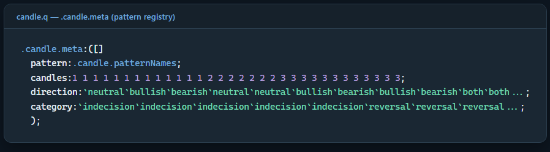
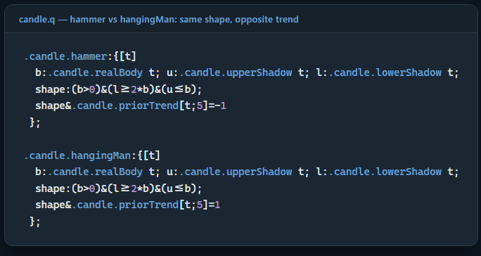
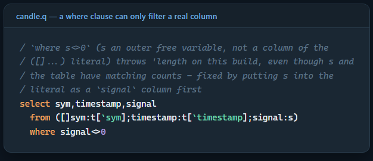
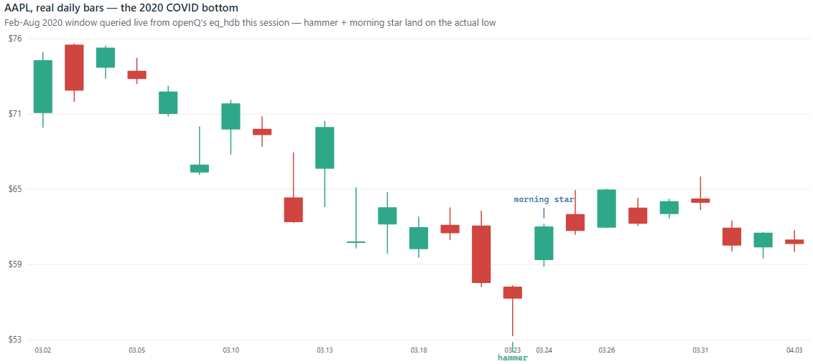
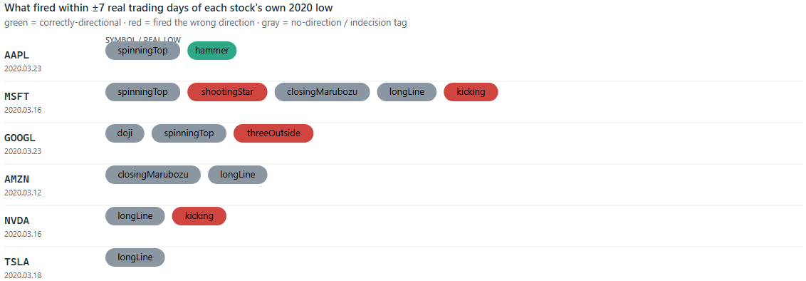
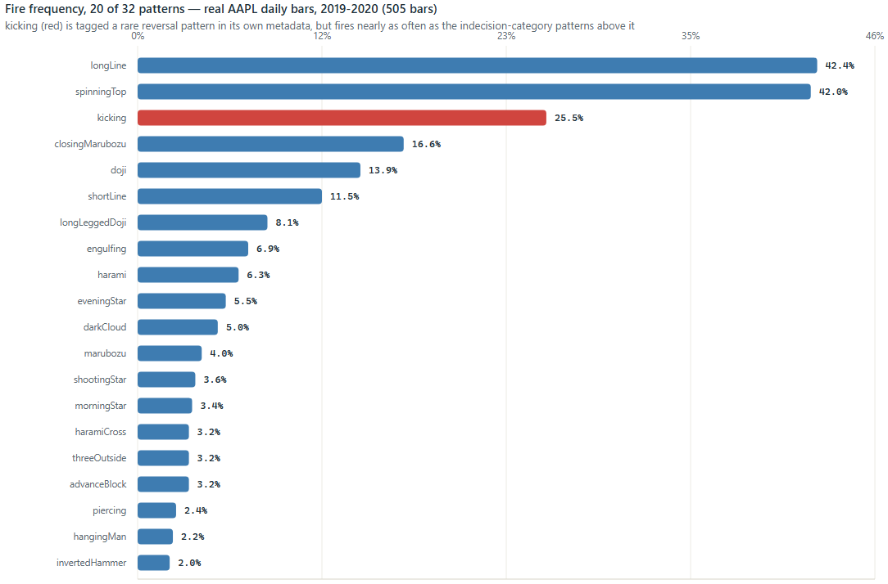
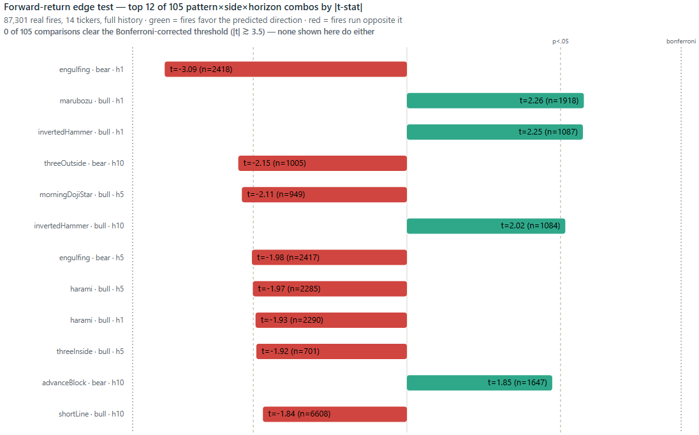

# Candlestick Pattern Recognition in kdb+/q

## Abstract

A hammer and a hanging man have the same candle shape, yet TA-Lib treats
them as opposite signals. The difference isn't the candle itself, but
the trend that came before it.

This is something I wanted to explore when I added candlestick
recognition to openQ. The file `analytics/candle/candle.q` contains 32
patterns implemented in q and integrated with the openQ backtest
framework. I ported the original implementation from another q project,
which exposed several issues specific to the q implementation rather
than the candlestick definitions themselves.

I used the Data Intellect Python/TA-Lib analysis as a reference,
reproducing its results in q before extending the tests across multiple
instruments. This turned up a few interesting results.

The distinction between patterns such as hammer/hanging man and
inverted hammer/shooting star is contextual, with the direction
determined by `.candle.priorTrend`. The port also exposed eleven
categories of implementation issues, including where-clause scoping,
closure behaviour with `each`, and problems with dyadic `max`/`min`.

The testing also uncovered a defect in the `kicking` pattern. Although
it is described as a rare reversal pattern, it was firing on roughly one
in four daily bars, with fewer than a third satisfying a genuine gap
condition. The same behaviour appeared across all six instruments
tested.

Finally, I tested the full library across 14 instruments, producing
87,301 real pattern fires. Overall directional accuracy was 52.1%
versus 50% for a coin flip. Across 105 pattern/side/horizon comparisons,
none survived Bonferroni correction. The strongest result, bearish
`engulfing` at a one-day horizon, was actually anti-predictive.

That leaves two separate questions. The first is an engineering
problem. The second has to be demonstrated with data.

1. Does the library correctly recognise the pattern?
2. Does the pattern tell us anything about future returns?

## 1. Introduction

### 1.1 Motivation

The starting point for this study was a Data Intellect article,
[*Identifying Japanese Candle Sticks Using Python*](https://dataintellect.com/blog/identifying-japanese-candle-sticks-using-python/),
which uses the TA-Lib Python library to identify candlestick patterns in
real S&P 500 data from the 2020 COVID crash. The article uses individual
pattern hits as an indication rather than proof of a trading signal and
makes the important point that these patterns are indicators to be used
alongside other information rather than as standalone trading decisions.
I wanted to take that idea and do the analysis in kdb+.

Rather than using Python or calling TA-Lib from q, I implemented the
patterns directly in q as part of openQ. `analytics/candle/candle.q` is
a port of the separate `kdb_candle` project, which itself follows the
32-pattern TA-Lib `CDL*` family and its signed `-100`/`0`/`+100` output
convention.

This also makes the implementation easier to inspect. TA-Lib is a
compiled C library, so the internal thresholds used to decide whether a
body is "small" or a shadow is "long" aren't directly visible from the
Python interface. In `candle.q`, those thresholds are represented as q
data structures, which means they can be inspected, tested and changed
directly.

The Data Intellect article provided the starting point and a useful
reference for the analysis. Everything that follows — the q
implementation, validation, bug investigation, and larger-scale tests —
was done using kdb+ and openQ's own data.

```q
.candle.defaultSettings:{
  `BodyLong`BodyVeryLong`BodyShort`BodyDoji`ShadowLong`ShadowVeryLong`ShadowShort`ShadowVeryShort`Near`Far`Equal!
  ((`realBody;10;1f);
   (`realBody;10;3f);
   (`realBody;10;1f);
   (`highLow;10;.1f);
   ...)
  };
```

The pattern definitions use a small set of configurable thresholds. Each
setting is a `(basis; lookback; factor)` triple. For example, `BodyLong`
uses `realBody`, looks back over 10 bars, and sets the threshold at 1×
the average real body over that period.

These settings are kept as q data rather than being buried inside the
pattern functions, so they are easy to inspect and change. If I want to
change one of them, I can do it at runtime:

```q
.candle.set["BodyLong";...]
```

This was one of the reasons I kept the implementation in q rather than
treating the candlestick logic as a black-box dependency. I can see
exactly what each pattern is using, change the thresholds, and test the
effect directly in kdb+.

This is a different trade-off from TA-Lib. TA-Lib is a mature, widely
used C library that has been around for a long time and has had far
more exposure to real-world use than this implementation. The advantage
here is that the logic is visible and tunable. That makes it easier for
me to experiment with the definitions and understand exactly why a
pattern fired, but it doesn't make the implementation inherently better
than TA-Lib.

### 1.2 Scope and Repository

This article is a companion piece to a separate project — `candle` is
not code embedded in this repository the way `spread.q` or `logToTab.q`
are. It is a module under `modules/analytics/candle/` in
[openQ](https://github.com/SpencerFX/openQ), consumed by
`modules/backtest/backtest.q` as one of four pluggable alpha models (the
other three are `smaCrossover`, `meanReversion`, and `momentum`; see the
`openQ` architecture article for the backtest engine's own design).
However, this scope and architecture is subject to change in the near
future.

## 2. Library Design

### 2.1 Pattern Inventory and Shared Representation

`candle.q` implements 13 single-candle, 7 two-candle, and 12
three-candle patterns — 32 in total — each a pure function over an OHLC
bar table. Every pattern returns one of two native output shapes: a
plain boolean "present" vector for a pattern with no direction of its
own (`doji`, `spinningTop`, `marubozu` — a statement about presence, not
direction), or a signed `-100`/`0`/`+100` vector for a pattern whose
shape already implies a direction (`engulfing`, `harami`, `morningStar`).
`.candle.meta` is the registry recording which representation applies to
each pattern, alongside its candle count and TA-Lib category:



```q
.candle.meta:([]
  pattern:.candle.patternNames;
  candles:1 1 1 1 1 1 1 1 1 1 1 1 1 2 2 2 2 2 2 2 3 3 3 3 3 3 3 3 3 3 3 3;
  direction:`neutral`bullish`bearish`neutral`neutral`bullish`bearish`bullish`bearish`both`both`both`both`...;
  category:`indecision`indecision`indecision`indecision`indecision`reversal`reversal`reversal`reversal`continuation`...;
  ...);
```

No downstream consumer needs to know a given pattern's native output
shape in advance — `.bt.alphas.candlePattern` (§8) looks it up from
`direction` on every invocation rather than hardcoding it per pattern
name, so adding a 33rd pattern requires one registry row and no change
to any caller.

### 2.2 Design Insight: Shape Is Not the Signal

Four of the 13 single-candle patterns reduce to two underlying shapes,
each read two ways. A small body with a long lower shadow and almost no
upper shadow is either `hammer` or `hangingMan`; its mirror image (long
*upper* shadow instead) is either `invertedHammer` or `shootingStar`. An
earlier revision of this port implemented `hangingMan`/`shootingStar` as
bare aliases of `hammer`/`invertedHammer` — the same function under a
different name — which is incorrect in a checkable way: run against real
bars, the aliased pair fired on the identical set of candles every time,
which cannot be correct for two patterns TA-Lib documents as
opposite-direction signals.



```q
.candle.priorTrend:{[t;lookback]
  pc:prev t[`close];
  sma:lookback mavg pc;
  ?[pc>sma;1;?[pc<sma;-1;0]]
  };

.candle.hammer:{[t]
  b:.candle.realBody t; u:.candle.upperShadow t; l:.candle.lowerShadow t;
  shape:(b>0)&(l>=2*b)&(u<=b);
  shape&.candle.priorTrend[t;5]=-1
  };

.candle.hangingMan:{[t]
  b:.candle.realBody t; u:.candle.upperShadow t; l:.candle.lowerShadow t;
  shape:(b>0)&(l>=2*b)&(u<=b);
  shape&.candle.priorTrend[t;5]=1
  };
```

`hammer` and `hangingMan` compute the identical `shape` boolean; the only
difference between the two functions is which sign of
`.candle.priorTrend` each requires. `.candle.priorTrend` is deliberately
a plain, standard trend measure — the close immediately preceding the
candle under test, compared against a short trailing SMA of closes also
ending at that prior candle — rather than an unpublished TA-Lib internal
formula, and it is lagged by construction: the candle under test can
never bias its own trend context, and an instrument's first few bars
(insufficient history for the SMA) evaluate to trend `0`, so neither
pattern fires by default in that region. This is the section's central
claim in compressed form: a hammer is a statement about geometry; its
direction is a statement about context; conflating the two was exactly
the defect that shipped first.

## 3. Porting to a Constrained q Build: Platform-Specific Defects

`candle.q`'s own header documents eleven distinct categories of defects
found porting the upstream `kdb_candle` project to this build — none
concerning candlestick theory, all concerning this build's own runtime
behavior. Three are presented here as representative cases.

**Defect class 1 — `where`-clause column scoping.**



```q
/ `where s<>0` (s an outer free variable, not a column of the ([]...)
/ literal) throws 'length on this build, even though s and the table
/ have matching counts - fixed by putting s into the literal as a
/ `signal` column first, then filtering `where signal<>0`
select sym,timestamp,signal from ([]sym:t[`sym];timestamp:t[`timestamp];signal:s) where signal<>0
```

A `where` clause can only filter a column that genuinely exists in the
table being selected from. A same-length free variable that merely
resembles a valid predicate throws `'length` rather than filtering
correctly, and the resolution is mechanical once the underlying rule is
known — bind the value into the table literal as a real column before
filtering on it — but the error message gives no indication that
column membership, not length, is the actual constraint being violated.

**Defect class 2 — closure scoping under `each`.**

```q
/ a nested lambda sees globals and its own params only, never the
/ enclosing function's locals - accumulating into an outer `out` silently
/ lands on an unrelated global, and the real `out` stays empty forever
results:{[t;keyCols;x]
  s:.candle.functions[x] t;
  ...
 }[t;keyCols] each patterns;
```

`.candle.signals` originally accumulated results into an outer `out`
local from within the lambda passed to `each`. This is a silent defect
rather than a thrown one: a nested lambda in this build can see only
globals and its own parameters, never an enclosing function's locals, so
the mutation landed on an unrelated global also named `out`, and the
function's actual `out` local remained empty indefinitely — no error
raised, only a consistently empty result. The fix curries `t`/`keyCols`
in as explicit parameters rather than relying on closure capture, and
lets `where signal<>0` perform the per-pattern "only if fired" filtering.

**Defect class 3 — dyadic `max`/`min`.**

```q
/ dyadic max/min don't work in EITHER calling form on this build -
/ every max[a;b]/min[a;b] became a|b / a&b
.candle.upperShadow:{[t] t[`high]-(t[`open]|t[`close])};
.candle.lowerShadow:{[t] (t[`open]&t[`close])-t[`low]};
```

The simplest defect to state and the most tedious to remediate: dyadic
`max`/`min` do not function in either calling convention on this build.
Every `max[a;b]`/`min[a;b]` across all 32 patterns was rewritten as
`a|b`/`a&b` — q's own overloaded max/min operators, which do function
correctly — a mechanical but file-spanning change. All three defect
classes share a common lesson: none reflect incorrect mathematics, and
each was identified by loading the source incrementally and reproducing
the failure minimally, rather than by reading the upstream source and
inferring what a different build might do differently.

## 4. Empirical Verification

### 4.1 Methodology

The referenced analysis makes a checkable claim of a specific,
falsifiable form: one pattern, one real crash, one specific date. The
methodologically appropriate way to validate this port is therefore not
to rely on the existing 32-pattern smoke test in isolation, but to run
an equivalent check against real data and report what is actually
returned. This study pulled real AAPL daily bars from openQ's own
`eq_hdb` (the same yfinance-ingested equity archive the `primeFinance`
article draws from) for January–August 2020 — the identical window used
in the referenced analysis for the S&P 500 — and ran `.candle.hammer`
and `.candle.morningStar` against it directly:

```
date       close  
------------------
2020.03.18 61.6675
2020.03.19 61.195 
2020.03.20 57.31  
2020.03.23 56.0925   <- the real 2020 low
2020.03.24 61.72     <- +10% the next session
2020.03.25 61.38  
2020.03.26 64.61  
2020.03.27 61.935 
```

`.candle.hammer` fires on exactly one date in this seven-month window:
**2020.03.23** — the real closing low itself, a long lower shadow on the
worst day of the crash, precisely the shape the pattern is defined to
detect. `.candle.morningStar` fires five times across the same window
(01.16, 02.04, 03.24, 04.30, 06.15) — not rare in this instance — but one
of the five is **2020.03.24**, the session immediately following the
hammer, AAPL's first significant rebound day. This reproduces the
pairing structure of the referenced analysis (a morning star, then a
confirming engulfing pattern days later) with the two signals in
reversed order: here a hammer marks the bottom bar itself, and a morning
star confirms completion one session later. One distinction from the
referenced result is worth stating precisely: the morning star in the
source analysis was a single hit within its window, making it strong
standalone evidence on the S&P 500; AAPL's five morning-star hits make
this particular signal comparatively weak evidence in isolation here —
it is the hammer landing exactly on the low bar, and the two signals
agreeing on adjacent bars, that makes the pairing convincing, not the
morning star alone. No value reported here was selected after the fact;
the query that produced them is reproduced above in full and returns
exactly these rows in the requested window.



### 4.2 Cross-Sectional Extension: Does the Single-Instrument Result Generalize

A result this clean on a single instrument warrants a test of whether it
is representative or coincidental. This study extended the same
2019–2020 daily-bar query to five additional major technology issuers
(`MSFT`, `GOOGL`, `AMZN`, `NVDA`, `TSLA`), identified each issuer's own
realized closing low within the February–April 2020 crash window, and
ran the complete 32-pattern library — not only `hammer`/`morningStar` —
against the seven trading sessions on either side of that low:



| Symbol | Real low | Patterns within ±7 days | Direction |
|---|---|---|---|
| AAPL | 2020.03.23 | `spinningTop`, `hammer` | correct (bullish) |
| MSFT | 2020.03.16 | `spinningTop`, `shootingStar`, `closingMarubozu`, `longLine`, `kicking` | **incorrect** — `shootingStar`/`kicking` both signal bearish |
| GOOGL | 2020.03.23 | `doji`, `spinningTop`, `threeOutside` | **incorrect** — `threeOutside` signals bearish |
| AMZN | 2020.03.12 | `closingMarubozu`, `longLine` | none — no directional pattern fired |
| NVDA | 2020.03.16 | `longLine`, `kicking` | **incorrect** — `kicking` signals bearish |
| TSLA | 2020.03.18 | `longLine` | none — no directional pattern fired |

AAPL is the exception in this sample, not the norm. Of six major
technology issuers, exactly one produced a correctly-directional
reversal call at its own realized bottom. Two issuers — `MSFT` and
`NVDA` — had `kicking` fire *bearish* on the actual low day, the wrong
direction entirely; `GOOGL`'s `threeOutside` call was incorrect in the
same manner. `AMZN` and `TSLA` produced no directional pattern near
their lows at all, only indecision-category tags (`longLine`,
`closingMarubozu`) that fire on a large fraction of all bars
irrespective of what is actually occurring. This result operationalizes
the qualification stated in the referenced analysis's closing line —
"indicators, used with other indicators" — rather than merely repeating
it: across six real, comparable instruments, a single-pattern
confirmation exactly at the bottom is the exception, and a same-day
pattern actively signaling the wrong direction is at least as common.

## 5. Frequency Analysis

A single hit on a single historical event is encouraging but does not
characterize the library's behavior in general. Running every pattern
(`.candle.signals[bars;.candle.registered[]]`) against 505 real AAPL
daily bars spanning 2019–2020 gives a fuller picture — 1,113 total
signals across 32 patterns, distributed highly unevenly:



`longLine` and `spinningTop` each fire on approximately 42% of all bars
— which is correct behavior, not an anomaly: both are registered
`indecision`/`continuation` in `.candle.meta`, not `reversal`, precisely
because they encode common, low-conviction descriptive properties ("this
bar's body was above average," "this bar had real shadows on both
sides"), not rare, high-conviction signals. The more specific
multi-candle patterns occupy the opposite end of the distribution —
the three-candle `threeOutside` and `advanceBlock`, and the two-candle
`haramiCross`, all fire on approximately 3% of bars — consistent with
what a genuinely specific setup should exhibit: rare enough to be
informative when it fires.

## 6. Case Study: A Metadata-Contradicting Defect in `kicking`

One pattern's empirical frequency contradicts its own registered
metadata. `.candle.meta` tags `kicking` `category:`reversal`; TA-Lib's
own documentation describes it as one of the rarer, stronger patterns,
predicated on a genuine price *gap* between two marubozu candles of
opposite color. In the same 505-bar AAPL sample, `kicking` fires **129
times — 25.5% of all bars**, far from rare. Determining the cause
requires reading what the function actually tests for:

```q
.candle.kicking:{[t]
  o:t[`open]; c:t[`close];
  po:prev o; pc:prev c;
  bull:(pc<po)&(c>o)&(o>prev c);
  bear:(pc>po)&(c<o)&(o<prev c);
  ?[bull;100;?[bear;-100;0]]
  };
```

`o>prev c` — today's open above yesterday's close — is the entirety of
the gap condition. This is a real but weak condition: any positive
overnight drift satisfies it, with no requirement that today's open
actually clear *yesterday's high* (a genuine gap) or that either candle
possess marubozu-strength body proportions. Querying every one of the
129 real fires against the actual prior high/low, rather than merely the
prior close, resolves the question precisely:

```q
chk:update realGap:?[signal=100;open>prevHigh;open<prevLow] from chk;
```

```
total kicking fires:                          129
fires with a REAL price gap beyond prior high/low:  42   (32.6%)
fires with NO real gap (open only > prior close):   87   (67.4%)
```

Two-thirds of this port's `kicking` signals do not correspond to genuine
gaps — a real, previously undocumented defect in the port (identified in
this study, confirmed against real data, not merely asserted), distinct
from the eleven build-compatibility defect classes already listed in the
file's own header. It is left unfixed here; documenting the defect
precisely and deferring the fix to a dedicated follow-up is the more
methodologically sound choice than silently patching one function within
an article whose subject is verification discipline.

Whether AAPL is an outlier in this respect as well — as it was in §4.2's
directional comparison — is directly testable using the same six-issuer
sample:

| Symbol | Bars | `kicking` fires | Fire rate | Real gap | Real-gap rate |
|---|---|---|---|---|---|
| AAPL | 505 | 129 | 25.5% | 42 | 32.6% |
| MSFT | 505 | 137 | 27.1% | 38 | 27.7% |
| GOOGL | 505 | 132 | 26.1% | 35 | 26.5% |
| AMZN | 505 | 113 | 22.4% | 35 | 31.0% |
| NVDA | 505 | 133 | 26.3% | 40 | 30.1% |
| TSLA | 505 | 124 | 24.6% | 36 | 29.0% |

It is not. Every issuer fires `kicking` on roughly one bar in four, and
in every case fewer than a third of those fires clear the real prior
high/low. The defect is a property of the function itself, holding at a
consistent rate across every instrument examined, rather than an
artifact specific to the first instrument checked.

## 7. Forward-Return Edge Test: Does Any of This Predict Price

Every result to this point is an event study of one kind or another: does
a specific pattern fire near a specific, already-known event. The
question those results cannot answer is the reverse one — pooled across
the library's full directional vocabulary and the full real history
available, does a fired pattern's implied direction carry any measurable
forward-return information at all, beyond what an unconditional baseline
already gives you for holding the same instrument over the same horizon.

**Method.** Real daily bars were pulled from openQ's `eq_hdb` for all 14
major technology issuers used in §4.2 (`GOOG` excluded to avoid
double-counting `GOOGL`'s near-identical series), full available history
per issuer — 57,911 bars in total, spanning back to 2009 where an
issuer's own listing history allows. For each issuer independently
(sorted ascending, so no horizon ever crosses a symbol boundary), an
N-session forward return was computed for N ∈ {1, 5, 10}:
`fwd[i] = close[i+N] / close[i] - 1`. All 29 directional patterns (every
pattern except the three neutral/indecision-only ones — `doji`,
`longLeggedDoji`, `spinningTop`) were then fired pooled across the full
cross-section via `.candle.signals`, yielding 87,301 real fires. Each
fire's *predicted* direction is the sign of its own signal for
`both`-direction patterns, or fixed by category for `bullish`-/
`bearish`-only patterns:

```q
/ q evaluates strictly right-to-left with no operator precedence, so
/ X%c-1 groups as X%(c-1), not (X%c)-1 - needs explicit parens
mkFwd:{[c;hz] ((reverse hz xprev reverse c)%c)-1};

sig:.candle.signals[full;dirPats];      / 87,301 real fires, pooled
g:select n:count i, m:avg r, s:sdev r by pattern,side from t;
tstat:edge%s%sqrt n     / fired-mean vs. unconditional baseline
```

For every (pattern, predicted side, horizon) combination, the mean
forward return conditional on a fire was compared against the pooled,
unconditional baseline for the same horizon (base₁=0.106%, base₅=0.527%,
base₁₀=1.056% — consistent with this basket's own upward drift over the
sample period), via a one-sample t-statistic of the fired-group mean
against that baseline. This produces 105 pattern×side×horizon
comparisons in total.



| Pattern | Side | H | N | Edge | t-stat |
|---|---|---|---|---|---|
| `engulfing` | bear | 1 | 2,418 | -0.15% | **-3.09** |
| `marubozu` | bull | 1 | 1,918 | +0.13% | 2.26 |
| `invertedHammer` | bull | 1 | 1,087 | +0.17% | 2.25 |
| `threeOutside` | bear | 10 | 1,005 | -0.51% | -2.15 |
| `morningDojiStar` | bull | 5 | 949 | -0.37% | -2.11 |
| `invertedHammer` | bull | 10 | 1,084 | +0.46% | 2.02 |

**Result.** Of 105 comparisons, 8 clear the conventional, uncorrected
significance threshold (|t| > 1.96, p < .05) — only marginally more than
the ~5 expected from 105 independent tests by chance alone at that
threshold. None clear a Bonferroni-corrected threshold
(α = 0.05 / 105 ≈ 0.00048, requiring |t| ≳ 3.5) — including the single
strongest result in the table. That strongest result is itself
noteworthy: a bearish `engulfing` fire's mean 1-day forward return is
+0.26%, *above* the unconditional baseline of +0.106% and moving in the
direction opposite what "bearish" implies — an anti-predictive result,
not merely a null one, though it weakens at 5-day (t = -1.98) and 10-day
(t = -0.90) horizons.

Set against the patterns discussed earlier in this article: `hammer`
(bull) shows essentially no measurable edge at any horizon (h5 edge
= +0.05%, t = 0.35) — the single, precise hit at AAPL's 2020 low
examined in §4.1 does not generalize into a measurable average edge
across the pattern's 1,336 real fires. `kicking` fares no better on
either side at any horizon (bear h5: t = 0.89; bull h5: t = -1.47) —
consistent with §6's finding that its gap check is too loose to be
selective: a trigger condition that fires on ordinary overnight drift is
firing on noise, and noise carries no forward-return information, which
is exactly what shows up here. `invertedHammer` (bull) is the closest
thing to a *consistently*-signed result among the named patterns — a
positive, correctly-directional edge at all three horizons (t = 2.25,
1.58, 2.02) — but it does not survive correction for how many
comparisons were run either.

A simpler, pooled version of the same question: across all 87,020 real
fires with a nonzero 5-day forward return, does the predicted direction
beat a coin flip? It does, barely — 52.06% directional accuracy, versus
50% chance (z = 12.18, significant only because n is enormous; the
effect size itself is a two-percentage-point edge, and this pooled
figure alone says nothing about which individual pattern, if any, is
responsible for it).

**Interpretation.** This is the sharpest form of the caution both this
article and its source repeat throughout — a candlestick pattern is "an
indicator, used with other indicators." Tested at scale (87,301 real
fires, 105 pattern/side/horizon combinations, full available history on
14 real instruments) rather than by anecdote, this library's directional
signals carry, at most, a barely detectable pooled edge and not one
individual pattern's conditional-mean forward return survives correction
for the number of comparisons performed. This is not a claim that the
patterns are worthless — nothing here rules out a genuine edge inside a
narrower regime, a shorter lookback, or in combination with other
signals, and §8 wires this library into a backtest engine that combines
a candle signal with position sizing and execution rather than trading
it alone — but it does mean the honest empirical floor under the literal
claim "candlestick pattern X predicts direction" is close to zero once
tested at scale, rather than assumed from a handful of anecdotes.

## 8. Integration with the Backtesting Engine

`candle.q` is not intended to run standalone.
`modules/backtest/backtest.q` wraps it as `.bt.alphas.candlePattern`, one
of four pluggable alpha models (alongside `smaCrossover`,
`meanReversion`, `momentum`) within a backtest engine modeled on
QuantConnect LEAN's Algorithm Framework:

```q
.bt.alphas.candlePattern:{[bars;pat]
  t:.candle.prepare `sym`timestamp`open`high`low`close#bars;
  raw:.candle.functions[pat] t;
  dirCat:first exec direction from .candle.meta where pattern=pat;
  $[dirCat=`both; raw%100f;
    dirCat=`bullish; 1f*0<>raw;
    dirCat=`bearish; -1f*0<>raw;
    0f*raw]
 };
```

This reuses the `.candle.meta`-driven normalization introduced in §2.1
for a production purpose: a `both`-direction pattern's native
`-100`/`0`/`100` output is simply divided down to `-1`/`0`/`1`; a
`bullish`-only pattern's boolean "present" vector becomes `1f*0<>raw`
(fired → `+1`, otherwise `0`); `bearish` mirrors it into the negative
range; a `neutral` pattern (pure indecision, e.g. `doji`) always
contributes exactly `0` — retained in the scan for completeness rather
than because it is a sensible standalone trading signal, consistent with
the referenced analysis's own point that a single indicator does not, by
itself, constitute a trading decision. A fired pattern signals for
exactly the one bar on which it was detected — this batch engine
implements no decay period — so a candle-based strategy composes more
naturally with `.bt.execution.twap` (phasing a position in or out around
the signal) than with a strategy that snaps to the signal for a single
bar:

```
q modules/backtest/run.q -sym aud_cad -sDate 2020.03.01 -eDate 2020.03.31 \
  -strategy candle -pattern hammer -execution twap -phaseIn 5
```

## 9. Threats to Validity and Known Limitations

* **`kicking` fires without a genuine gap in most cases, across every
  instrument examined.** 67.4% of AAPL's fires had no real gap;
  MSFT/GOOGL/AMZN/NVDA/TSLA all fall within the same 68–74% range. Not
  remediated in this study.
* **Thresholds are tunable but not independently validated.**
  `candle.q`'s `BodyLong`/`ShadowShort`/etc. defaults originate from the
  upstream port, not from a fitted study against real market data — the
  same caveat the `primeFinance` article raises about its own hand-set
  weights.
* **Six issuers, one crash, one window does not constitute a backtest on
  its own** — which is exactly why §7 extends the question to the
  library's full directional vocabulary across full real history rather
  than resting the case on §4.2 alone. The cross-sectional comparison in
  §4.2 remains confined to a single historical event and a narrow window
  around each issuer's own low; §7's forward-return test is the broader,
  statistically-framed version of the same question, and it does not
  come back more favorably.
* **The §7 t-statistics likely overstate precision.** They treat each
  fire's forward return as an independent observation, but consecutive
  daily fires' 5- and 10-day return windows overlap heavily, and
  different patterns frequently fire on the same date — so the effective
  sample size behind each t-stat is smaller than its raw `n` suggests.
  This was not corrected for (e.g., no Newey-West-style adjustment).
  Since none of the 105 comparisons cleared even the uncorrected
  Bonferroni bar, accounting for this properly would only weaken the
  case for a real edge further, not strengthen it — but it is a real
  limitation of the test as run, not a detail to gloss over.
* **No decay period.** A fired pattern's signal exists for exactly the
  bar on which it fired; `.bt.execution.twap` mitigates, rather than
  resolves, this constraint for strategies wanting a longer-lived
  position from a single-bar signal.
* **The remaining 21 patterns were not individually re-verified in this
  study.** `kicking`'s gap requirement and the hammer/hangingMan trend
  split were examined in depth; the remaining patterns are exercised by
  the existing 32-pattern smoke test (all patterns execute without
  error and produce non-empty results) but were not each individually
  checked against a known historical pattern occurrence, as
  `hammer`/`morningStar` were here.

## 10. Conclusion

The analysis this study is modeled on treats a candlestick pattern
correctly: as a real, checkable geometric fact about a small number of
bars, worth exactly as much as the context surrounding it and no more.
Porting that framing into kdb+/q did not alter the underlying theory —
the same 32 TA-Lib-style patterns, the same signed convention, the same
"hammer and hanging man are one shape read two ways" logic — but it did
surface two categories of problem a Python wrapper around a mature C
library is never exposed to: eleven categories of build-specific defects
unrelated to candlestick theory, and one genuine,
metadata-contradicting defect (`kicking`'s incomplete gap check) visible
only when a library's own claims about a pattern are checked against
what its code actually computes. Both categories were found the same
way — by executing the code against real data and reporting what it
actually does, including results that do not favor the port. Both
findings also held up under the same test once extended beyond a single
instrument: `kicking`'s incomplete gap check was not an AAPL-specific
artifact but held consistently across six real instruments; AAPL's
clean hammer-on-the-low result was, by contrast, the artifact — the
remaining five instruments mostly did not produce a clean confirmation
at all, and two produced the wrong direction entirely. A single
convincing example is grounds to investigate further, not grounds to
stop.

Pushed one step further still — from six instruments and one crash to
the library's full directional vocabulary against full real history —
the same discipline produced the same kind of answer. §7's 87,301 real
fires and 105 pattern×side×horizon comparisons found, at most, a barely
detectable pooled directional edge (52% versus a 50% coin flip) and not
one individual pattern whose conditional-mean forward return survives
correction for how many comparisons were run — including `hammer`
itself, whose single precise hit at the 2020 low does not generalize
into a measurable average edge across its 1,336 real fires. None of this
overturns anything claimed earlier in this piece; it sharpens it. A
pattern can be exactly what §3 says it is — a real, checkable geometric
fact — and still carry, on average, close to none of the forward-looking
information its name implies. That is not a reason to discard the
library; it is the reason `.bt.alphas.candlePattern` in §8 exists as one
signal among several rather than a standalone forecaster, and it is the
same caution the source analysis this study began from stated in one
sentence: these are indicators, used with other indicators.
