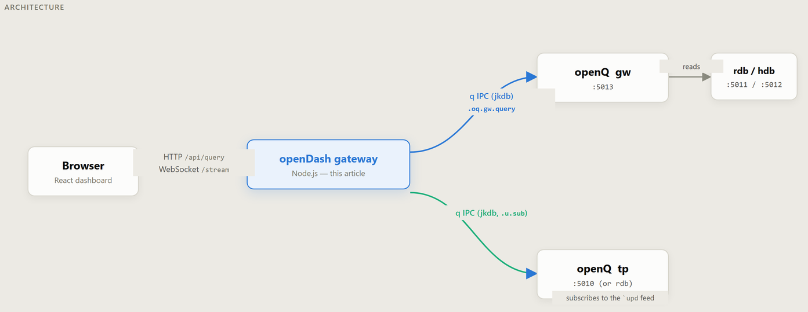
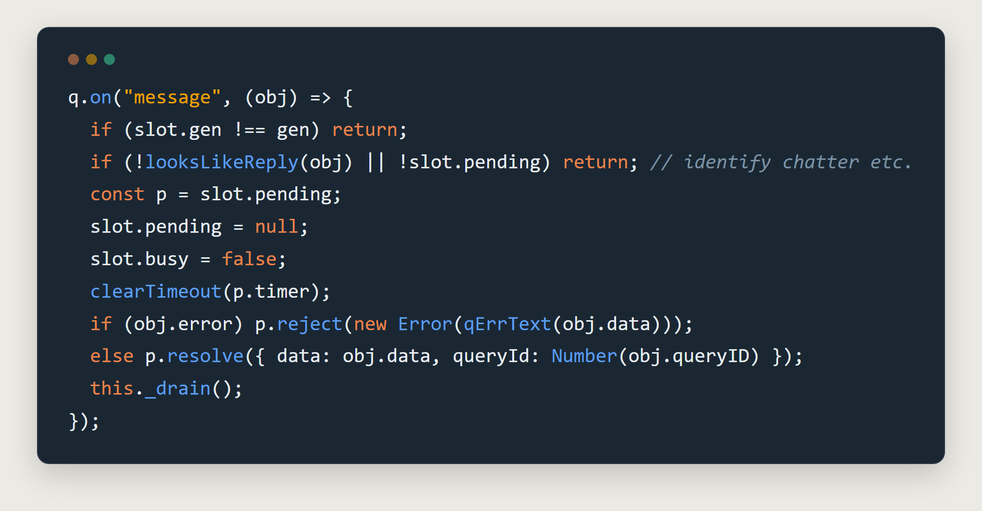
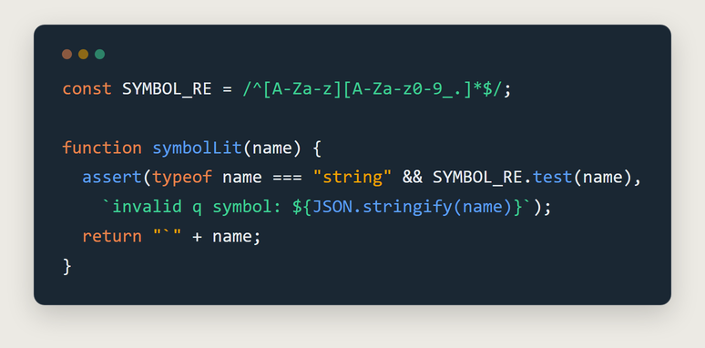
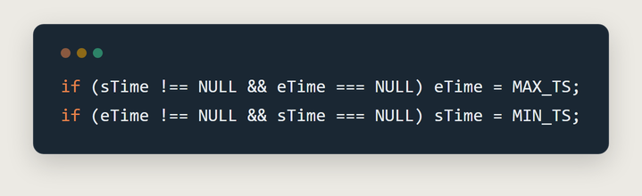
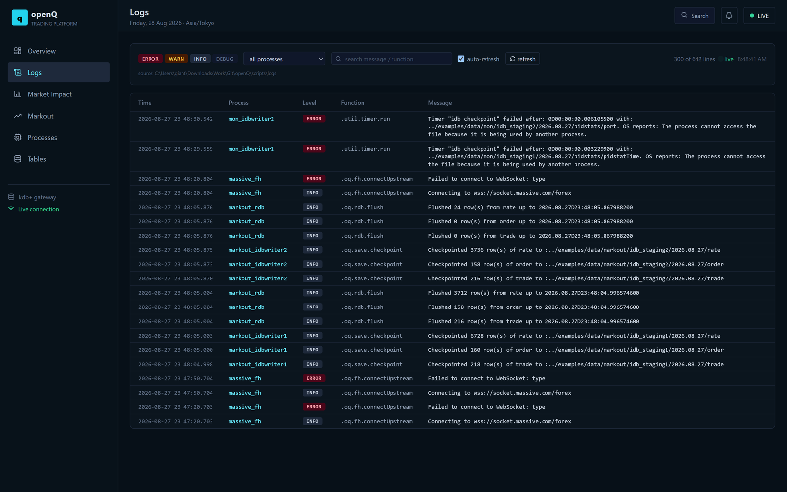
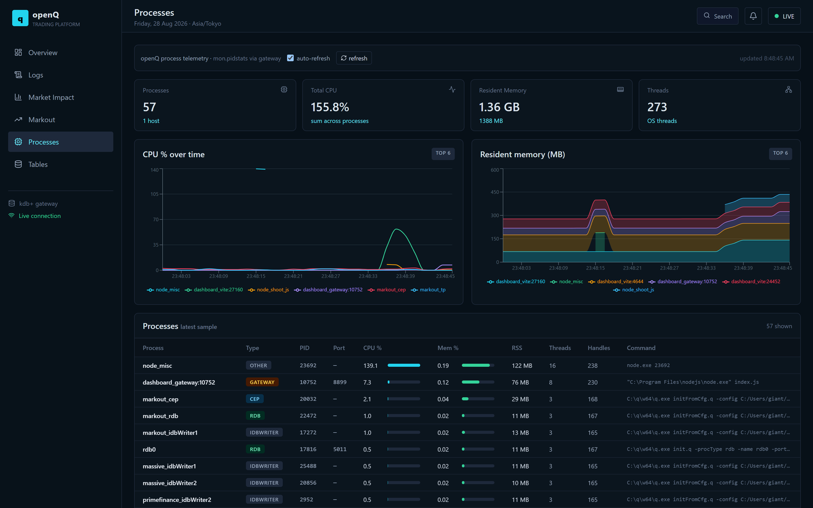
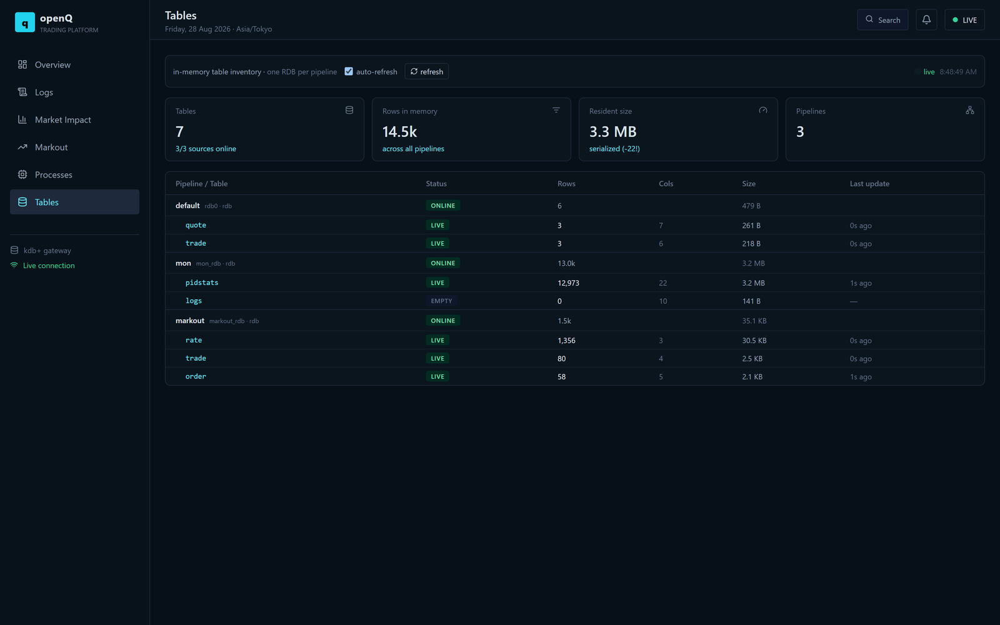
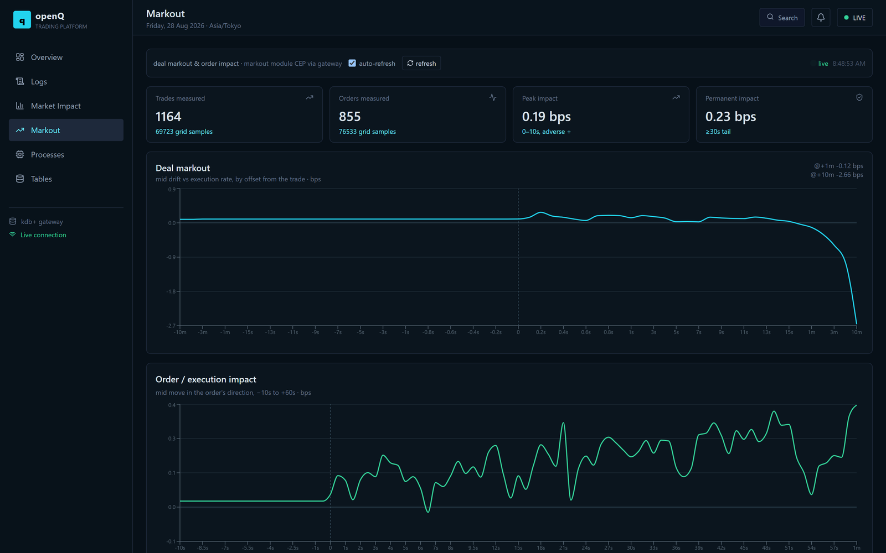

# openDash: Bridging a Browser to kdb+ Over Async IPC

## Summary

A browser can't speak q IPC. It's a binary TCP protocol with no HTTP or
WebSocket framing anywhere in it, so a React dashboard that wants to show
live kdb+ data needs something standing between it and the platform —
translating ordinary HTTP requests and WebSocket frames into q on one side,
and turning columnar q results back into JSON on the other.

That alone would be a straightforward proxy. What makes it more interesting
is *how* the kdb+ side of this particular platform (openQ, a separate
project) answers a query: its gateway process (`gw`) doesn't reply
synchronously. It replies with an **async message** carrying a `queryID` it
allocated itself. A normal client, blocked waiting for a response on one
connection, has no way to tell two concurrent replies apart on that same
socket — so "send a query, get an answer" isn't actually one request-response
pair here, it's a request and a *matching problem*.

`openDash` is the service that solves that, plus two problems that come
bundled with letting a browser drive any of this at all:

* **Correlation** — matching an async, self-numbered reply back to the
  request that caused it, without blocking every other in-flight query while
  one is slow.
* **Trust** — a browser is not a trusted q client. Nothing it sends should be
  capable of becoming arbitrary q code.
* **Fan-out** — one upstream tick feed, many browser tabs, each interested in
  a different subset of symbols.

## Repo

This is a companion piece to a separate project —
**[openDash](https://github.com/SpencerFX/openDash1)** isn't code embedded
in this repo the way `spread.q` or `logToTab.q` are. It sits in front of
[openQ](https://github.com/SpencerFX/openQ), the author's kdb+ platform, and
reuses this repo's own `analytics/markOutImpact.q` unmodified as one of the
modules it serves live (see "What's live today" below). The architecture:

No q/kdb+ runs in the browser, and the gateway is a small, dependency-light
Node.js service (`ws` and a patched `jkdb` for the q IPC leg — nothing
else) rather than a general-purpose API framework.

## Why a pool, not one shared connection

The obvious design — one persistent connection, fire a query, await the
reply — breaks the moment two browser requests overlap. `gw`'s reply is an
async message shaped like `` `error`data`stack`queryID! ``, and there's no
way to ask "give me only replies for queryID 7" on a shared socket; every
reply lands on whichever connection happens to be listening.

The fix sidesteps the matching problem instead of solving it: keep a **pool**
of q connections, and never let more than one query be in flight on any one
of them. Whatever reply-shaped async message arrives next on a given
connection can only belong to the query that connection is currently
running.

Each pooled connection is a small state machine — `ready`/`busy`/`pending` —
and a request that arrives when every connection is busy waits in a queue
with its own timeout rather than piling onto one socket. A `gen` counter on
each slot exists specifically so a stale reply from a connection that's
since been recycled can't be mistaken for the answer to a newer query on the
same slot — reconnecting doesn't reuse an old generation's in-flight
promise. If a connection ever emits a malformed async frame, the whole slot
is recycled (closed, reconnected, any pending caller rejected) rather than
left in a state where a future reply might get matched to the wrong request.

## Never trust a browser to write q for you

The dashboard sends things like a table name, a symbol, a time range. None
of that is allowed to become q source text directly — a browser is exactly
the kind of client an injection concern is written for. Every dynamic piece
of a query is validated and re-emitted as a **literal**, not interpolated as
a string:

`buildGwQuery` assembles the exact string a legitimate q client would send —
`` .oq.gw.query[table;sCols;sTime;eTime;symb;whereC] `` — entirely out of
pieces that have already passed a regex or been round-tripped through a real
`Date`. The sixth argument, `whereC` (an arbitrary where-clause), is
hardcoded to the null symbol and never exposed over HTTP at all: not
because validating it would be especially hard, but because an arbitrary
where-clause *is* arbitrary code, and the smallest attack surface is the one
that was never wired up.

This layer is also where a real bug in openQ itself got worked around rather
than quietly avoided. `.oq.query.root` throws a `` `type `` error when
exactly one of the two time bounds is a real timestamp and the other is the
null-symbol sentinel — it evaluates `` `date$(sTime;eTime) `` for the HDB
partition clause, and that cast doesn't tolerate a mixed pair. Both bounds
set, or neither, both work fine. So when a caller supplies only one bound,
`qlit.js` materializes the other at the edge of the representable range
(`2000.01.01` / `2999.01.01`) rather than passing the mismatched pair
through and letting the query fail:

## One feed, many filters

The dashboard's live views subscribe over WebSocket, but the bridge to
openQ's tick feed is a single shared `.u.sub` connection, not one per
browser tab. openQ's own subscription semantics are per-*handle* and
**replace** rather than accumulate — two independent subscribe calls on the
same connection don't merge, the second overwrites the first. Give every
WebSocket client its own upstream connection and that's fine; make them
share one (to avoid opening dozens of q connections for dozens of idle
browser tabs) and their subscriptions would fight each other.

The resolution: subscribe to the **whole table**, once, reference-counted
per table name as clients come and go, and do symbol filtering downstream —
in the Node layer, per WebSocket client — instead of upstream in q. Every
client sees every row leave openQ; which rows actually reach *that* client's
socket is decided after the fact, not by what was asked for at subscribe
time.

## The jkdb patch

[`jkdb`](https://github.com/jshinonome/jkdb) is a small, third-party,
framework-free JavaScript q IPC client — not something written for this
project, just the wire-protocol library the gateway is built on. Before this
project needed it, `jkdb` only ever surfaced an async
message shaped like `` `upd `` (the standard tick.q publish pattern) as a
usable event; anything else async — including `gw`'s
`` `error`data`stack`queryID! `` reply — was silently dropped on the floor.
That's fine for a feed handler, and exactly wrong for a gateway that needs
to see *every* async reply regardless of its shape.

The fix was a small, additive patch to `jkdb` itself: a generic `message`
event fires for every deserialized async payload, and a separate
`asyncError` event fires for one that fails to parse. The existing `upd`
event is untouched, so nothing that already depended on `jkdb`'s original
behavior changed — `openDash` just started listening for the event that
was always arriving, previously invisible.

## What's live today

Four dashboard pages are backed by real gateway endpoints rather than mock
data — screenshots below are a live openQ platform (default pipeline +
`mon` + `markout` modules) running behind this exact gateway and dashboard.

**Logs** — `GET /api/logs` tails and parses openQ's per-role log files
(`gw.log`, `rdb.log`, …), folding stack-trace lines into the row they
belong to, with level/process/text filters.

**Processes** — reads openQ's `mon` module (`pidstats`, per-process
CPU/memory over time), fed on this Windows dev machine by a small
stand-in for the platform's real Linux `pidstat` poller.

**Tables** — a live inventory across every configured openQ pipeline: row
counts, column counts, byte size, and freshness per table, so "is data
actually flowing" is a glance instead of a query.

**Markout** — reads this repo's own `analytics/markOutImpact.q` state
straight off openQ's markout-module CEP: the deal-markout decay curve,
the order-impact decay curve, and the peak/permanent split, all live off
the same in-memory keyed tables the batch functions compute from
(`.markout.completed`, `.impact.completed`) — no separate reporting path,
no re-derivation.

## Known limitations

* **Time-bounded queries need a populated HDB.** Any query whose range
  reaches before "today" gets routed to the HDB as well as the RDB; against
  an HDB with zero partitions that date-clause throws. Bounds entirely
  within today, or no bounds at all, are unaffected.
* **`whereC` is permanently closed off**, by design, not by omission — see
  above.
* **Publishing is out of scope.** This service queries and subscribes; it
  never writes a tick into openQ. That's a feed handler's job, deliberately
  kept separate.

## Conclusions

None of this is about making a prettier dashboard. It's about making an
async, server-correlated, binary protocol behave like an ordinary REST and
WebSocket API without lying about what that API can safely do — no
arbitrary where-clauses reachable from a browser, no query silently
blocking every other one because they happen to share a socket, no
subscription silently stomping another client's. The same discipline shows
up in three different places (the connection pool, the literal-only query
builder, the reference-counted subscription) because it's the same
underlying rule applied three times: a browser gets exactly the surface
area it needs, and the plumbing behind that surface has to hold up when
several of them are asking for different things at once.
