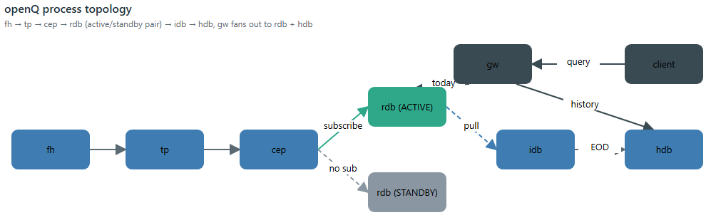
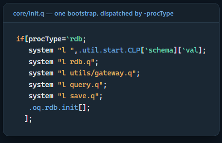
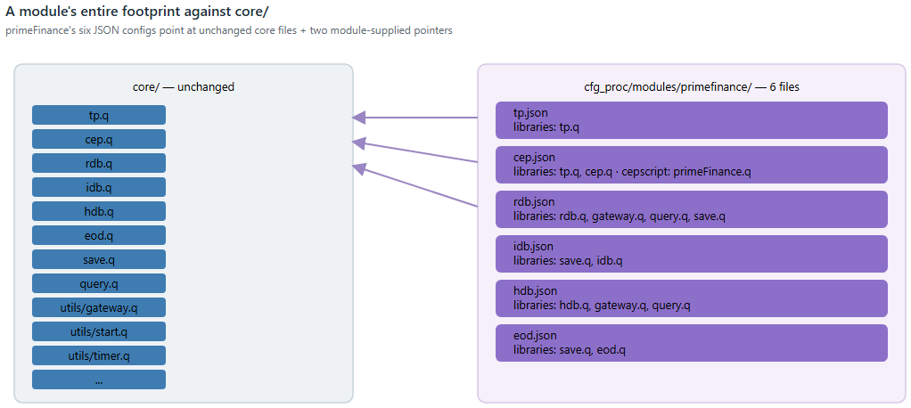
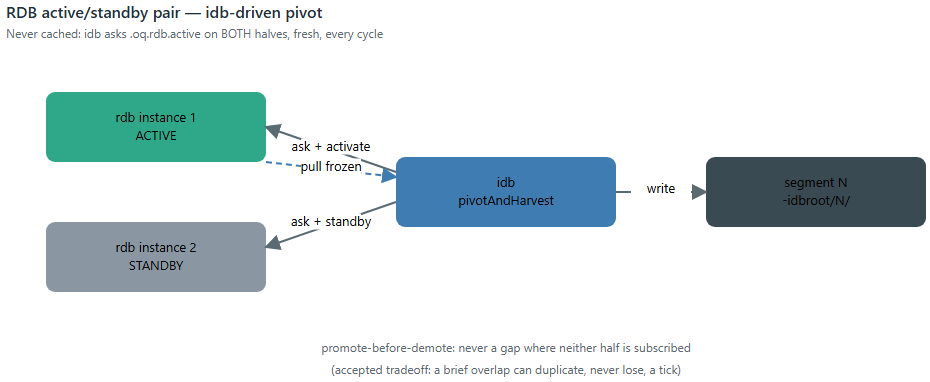
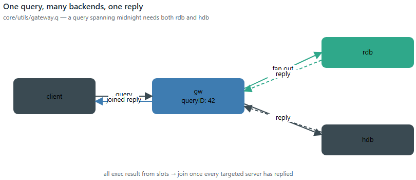

# A New Module Is Six JSON Files: The Architecture of openQ

## Summary

A kdb+ tick-database stack has a well-known shape — tickerplant, RDB, HDB,
gateway — and almost every real deployment ends up re-solving the same
handful of problems on top of it: how does a new business line plug in
without forking the core, how does an RDB fail over without losing ticks,
how does a batch writer avoid ever publishing a half-written date
partition. `openQ` is a from-scratch, from-first-principles answer to
those questions — a domain-generic core (`core/`) that six independent
modules (market data, FX spread analytics, trade markout, securities
lending, a monitoring stack, and a cross-module risk report) all run on
top of, unmodified.

This piece is about the core, not any one module's business logic — those
already have their own pieces (`spread`, `markout`, `openDash`,
`primeFinance`). Four things are worth being deliberate about:

* **The core is schema-agnostic and business-logic-free.** `tp`/`rdb`/
  `idb`/`hdb` don't know what a "spread" or a "locate" is — a module is a
  schema file, a config, and (optionally) one script the core loads by
  name. `primeFinance`'s entire footprint against `core/` is six JSON
  files; zero lines of `core/*.q` changed to add it.
* **Redundancy is two processes and an honest question, not magic.** An
  RDB is really an active/standby *pair* sharing one config — and the
  design only works because nothing in it ever trusts a locally-cached
  belief about which half is active; it asks, every single cycle.
* **Every durable write is staged, then atomically made real.** Both the
  once-a-day EOD promotion and the intraday `idb` checkpoint go through
  the same "write to a temp directory, then rename table-by-table" path —
  a design that exists because the naive version of it broke, for real,
  the first time two tables shared a HDB root.
- **A query doesn't go to one server, it goes to however many it needs
  to.** The gateway is a generic async scatter-gather engine — route to
  RDB, HDB, or both, fan out in parallel, join once every target has
  replied — with zero FX/lending/whatever-specific code in it at all.

Every code excerpt below is quoted verbatim from the real repo, and every
architectural claim was checked by reading the source, not asserted from
memory. No process was started or stopped to write this piece — it's
built entirely from the code and config already on disk.

## Repo

Like `openDash` and `primeFinance`, this is a companion piece to a
separate project — `openQ` isn't code embedded in this repo. It lives at
[SpencerFX/openQ](https://github.com/SpencerFX/openQ), and every module
this repo's other articles document (`spread`, `markout`, `primeFinance`)
is a tenant of the architecture described here, not a fork of it.



## The six steady-state roles

The core pipeline every module runs is six roles, each its own file
under `core/`, each schema-agnostic:

| Role | File | Job |
|---|---|---|
| `tp` | `tp.q` | Tickerplant — the ingestion point. Appends every update to a rolling on-disk log, then fans it out to subscribers. |
| `cep` | `cep.q` | Complex-event processor — subscribes upstream (a `tp`, or another `cep`), dispatches to registered handlers, can itself publish derived output downstream. |
| `rdb` | `rdb.q` | Today's data, in memory. Runs as an active/standby *pair* — see below. |
| `idb` | `idb.q` | Intraday durability writer — doesn't subscribe to anything; pulls frozen snapshots off the RDB pair on a timer instead. |
| `hdb` | `hdb.q` | Prior days' data, on disk, reloaded when a new date partition appears. |
| `gw` | `gw.q` | Query gateway — routes a client query to RDB, HDB, or both, and joins the replies. |

Three more roles round it out without being part of the steady-state
pipeline itself: `fh` (`fh.q`, a feed handler shell for vendor-specific
connect/parse/auth), `eod` (`eod.q`, a one-shot batch job that promotes
whatever `idb` has staged into the real dated HDB partition — see below),
and `housekeeping` (`housekeeping.q`, periodic health checks against a
running fleet). `core/init.q` dispatches on exactly these nine
`-procType` values and no others. The default flow for a module with its
own live feed is:

```
fh -> tp -> cep -> rdb (active/standby pair) -> idb -> hdb
                                                  ^
                                                  |
                                    client -> gw -+- rdb (today)
                                                  \- hdb (history)
```

`tp`/`rdb`/`idb`/`hdb` never load a module's schema by choice — they load
*whatever schema file they're told to* (`-schema`), and that's the entire
extent of what makes one module's stack different from another's. Nothing
under `core/` contains an `if sym=`AAPL` or an `if module=`primeFinance`.

## One bootstrap script, one dispatch table

Every process, regardless of role, starts through the same file —
`core/init.q` — which loads the shared utility layer once, then dispatches
by `-procType` to load that role's own file and call its `.init[]`:



```q
if[procType=`rdb;
   system "l ",.util.start.CLP[`schema][`val];
   system "l rdb.q";
   system "l utils/gateway.q";
   system "l query.q";
   system "l save.q";
   .oq.rdb.init[];
  ];
```

That split matters more than it looks: `init.q` only ever needs to know
*which files* a role needs, never *how* that role actually starts up.
Each role's own startup sequence — `tp.q`'s `.oq.tp.init`, `rdb.q`'s
`.oq.rdb.init`, and so on — lives inside that role's own file. A second
bootstrap script, `core/initFromCfg.q`, reads a JSON config instead of a
CLI flag list (see the next section) — and it reuses the exact same
per-role `.init[]` functions, calling `.oq.rdb.init[]` the identical way
`init.q` does. Nothing about how a role actually starts had to be written
twice.

The JSON path exists alongside the CLI path, not instead of it — a CLI
flag with the same name as a JSON key always wins:

```q
// A CLI flag with the same name as a JSON key still wins - e.g.
// `-config ../cfg_proc/rdb.json -port 5099` starts rdb on 5099 even though
// the JSON says 5011 - the JSON only fills in values the command line
// didn't already provide (see .oq.cfg.merge).
```

```q
.oq.cfg.merge:{[cfg]
  scalars:(`procType`name`port) inter key cfg;
  flat:(scalars#cfg),cfg`params;
  {[k;v] if[not k in key .util.start.params;.util.start.params[k]:enlist .oq.cfg.strOf v]}'[key flat;value flat];
 };
```

`if[not k in key .util.start.params;...]` is the whole mechanism — the
merge only ever *fills gaps* the command line left open, so `-port 5099`
on the command line is never overwritten by whatever `rdb.json` says.

## A module is six JSON files

This is the claim worth actually checking, not just stating. Here's
`primeFinance`'s complete footprint under `cfg_proc/modules/primefinance/`
— every JSON file that config directory contains, one per role
(`tp`/`cep`/`rdb`/`idb`/`hdb`/`eod`):



```json
{
  "procType": "cep",
  "name": "primefinance_cep",
  "port": 5074,
  "schema": "../schemas/schema_primefinance.q",
  "libraries": ["tp.q", "cep.q"],
  "params": {
    "srcaddr": ":localhost:5070",
    "cepscript": "../modules/analytics/primeFinance/cep.q",
    "eqhdbaddr": ":localhost:5090"
  }
}
```

Every `libraries` entry above (`tp.q`, `cep.q`) is a **core** file — the
exact same `cep.q` every other module's CEP loads. The only
module-specific things in the whole file are a schema path and a
`cepscript` path — one pointer to a table layout, one pointer to a
business-logic file the core loads by name and never inspects. Multiply
that by the other five roles (`tp.json`, `rdb.json`, `idb.json`,
`hdb.json`, `eod.json`, each following the identical shape) and that's
the entire integration surface: **zero lines under `core/` changed** to
add securities lending as a domain. The one thing worth flagging
honestly: `rdb.json`'s `tpaddr` param for this module is
`:localhost:5074` — that's the **CEP's** port, not the raw tickerplant's
(`:5070`). The param name is a holdover from the simpler `fh -> tp -> rdb`
case; in a module with a CEP in the middle, the RDB subscribes to the
CEP's derived output, not the raw feed — same code path
(`.oq.rdb.connectToTP`), just pointed one hop further down the chain.
Nothing enforces that naming is updated per-deployment; it's a real, if
minor, place the config's own field name can mislead a reader who hasn't
traced the actual flow.

Six config files, but not six *live* processes at any given moment:
`eod.json` describes a one-shot batch job (`core/eod.q`), and
`scripts/startupAllByModule.sh` deliberately never auto-starts it —
running it against an empty module would publish an empty partition for
today, and a real EOD run later the same day would then collide with it.
The five roles that *do* run continuously come to six live processes,
because `rdb` is itself a pair (`-instance 1`/`-instance 2` off the one
`rdb.json`, see below). Starting that whole stack is one script,
`scripts/startupAllByModule.sh primefinance`, which doesn't hardcode which
roles a module has — it starts whatever `cfg_proc/modules/<name>/*.json`
files actually exist (skipping `eod` specifically), in a preference order
that happens to match the
pipeline's own dependency order:

```bash
# Preference order - see header. Anything not listed here still gets
# started afterward (alphabetically), so a future module's unanticipated
# role isn't silently skipped.
PREFERRED_ORDER="tp cep rdb idb hdb fh gw housekeeping"
```

## Two processes pretending to be one

An "RDB" in openQ is never a single process — it's an **active/standby
pair** sharing one `rdb.json`, launched twice (`-instance 1`/`-instance
2`), each on its own resolved port. Only the active half is ever
subscribed to anything; a tickerplant has no idea the standby half even
exists.



Promotion and demotion are two plain, IPC-callable verbs —
`.oq.rdb.activate[]` / `.oq.rdb.standby[]` — and the design leans on one
discipline throughout: **nothing here ever trusts a cached belief about
which half is active.** `core/idb.q`, which is what actually drives the
pivot on a timer, asks both halves directly, every single cycle:

```q
//@desc
// Asks both rdbs directly which one is active RIGHT NOW, rather than
// trusting a locally-cached label - see this file's .oq.idb.h1/h2 comment
// for why that matters. Treats "both say active" or "both say standby" as
// an inconsistent state (0N) rather than guessing...
//@desc
.oq.idb.whichActive:{[h1;h2]
  a1:@[h1;".oq.rdb.active";{[e]0b}];
  a2:@[h2;".oq.rdb.active";{[e]0b}];
  $[a1 and not a2;1h;a2 and not a1;2h;0Nh]
 };
```

That question gets asked fresh because the alternative has a real failure
mode: `idb` could restart independently of the RDB pair mid-day, or an
operator could call `.oq.rdb.activate`/`.oq.rdb.standby` directly without
going through `idb` at all — either one leaves a cached "idb thinks X is
active" label silently wrong, with nothing to notice.

The pivot itself promotes the standby **before** demoting the old active —
a deliberate ordering tradeoff, not an oversight:

> Promoting BEFORE demoting (not the other way around) means there's
> never a gap where NEITHER instance is subscribed - the tradeoff is a
> brief window where both are, so a handful of ticks arriving in that
> exact instant could in principle land in both the just-frozen segment
> and the newly-active instance's next one. No deduplication is built for
> that here (deliberately)... the alternative (demote-first) trades that
> rare duplicate for an unrecoverable gap if anything is published in
> between, which is worse.

Two real correctness bugs came out of building this pair, both left in
place as comments rather than silently fixed and forgotten. First,
`.u.pub` — the tickerplant's own per-table fan-out — used to let one dead
subscriber handle take the whole publish down:

```q
//@desc
// Each send is individually protected (logs a WARN and moves on) rather than
// left to fail the whole each-loop - confirmed by instrumented testing that
// a churning subscriber (see core/rdb.q's active/standby pivot) can leave a
// handle in w25bang whose underlying socket the OS has ALREADY torn down...
// an unprotected throw here aborts this each-loop entirely, silently
// dropping delivery to every OTHER, perfectly healthy subscriber still left
// to iterate (e.g. the very instance that was just promoted active). This
// was the actual mechanism behind the "sometimes a pivot cycle loses data"
// symptom - not a corrupted subscriber list (verified clean via dispatch-
// order tracing), but one dead entry taking the rest of the batch down with it.
//@desc
pub:{[t;x]
 {[t;x;w]
  if[count y:sel[x;w 1];@[-25!;(enlist w 0;(`upd;t;y));{[h;e].util.log.ex[`WARN;`.u.pub]"Publish to handle ",(string h)," failed..."}[w 0]]]
  }[t;x] each w25bang t;
 }
```

Second, a standing-down active instance now unsubscribes **synchronously**
before closing its handle, instead of relying on the tickerplant's own
deferred disconnect cleanup to catch up eventually:

```q
//@desc
// A subscriber about to hclose (core/rdb.q's .oq.rdb.standby on an
// active/standby pivot) calls this SYNCHRONOUSLY first so its entries are
// pruned from .u.w before the socket goes away - closing the window in
// which .u.pub, iterating a still-listed but now-dead handle, logs a
// "handle N is not an ipc handle" WARN per update until .z.pc's own
// deferred cleanup catches up (which, on a tp/CEP busy relaying a live
// feed, can lag for seconds).
//@desc
unsub:{[] del[;.z.w] each t}
```

Both are the same lesson from two different angles: in a system built
around one process's identity flipping live, "eventually consistent
cleanup" isn't good enough the moment something else (a publish loop, a
pivot-and-harvest cycle) can observe the gap in between.

## idb doesn't subscribe to anything

The intraday durability writer looks, from its name, like it should be
another `tp` subscriber. It isn't. `idb` never appears in a tickerplant's
subscriber list at all — instead, on a timer, it **pulls** a frozen
snapshot straight off whichever RDB half it just demoted:

```
1. ask both rdbs which is ACTUALLY active right now (never cached)
2. activate the standby       - it starts receiving live ticks immediately
3. standby the old active     - its in-memory tables are now a frozen,
                                 unchanging snapshot
4. query that frozen snapshot table-by-table, write it as the next
   sequentially-numbered segment (0, 1, 2, ...) under -idbroot
5. tell that now-frozen rdb to flush its own memory - everything in it
   is durable now
```

This is modeled on a real kdb+tick `TmpHDBWriter`, and the "pull, don't
subscribe" choice is what makes the active/standby pair from the previous
section actually pay for itself: `idb` never buffers a single tick of its
own, so restarting `idb` mid-day loses nothing — the data it would have
buffered is either already durable on disk from the last harvest, or still
live in memory on whichever RDB half is currently active.

Both the once-a-day EOD promotion and every intraday `idb` checkpoint
write through the same low-level path: stage to a temp directory, then
publish it into place. The naive version of "publish" — move the whole
staged directory onto the destination in one shot — has a hole: it only
works when the destination doesn't exist yet. `save.q` doesn't do that,
and the comment explaining why is a genuine incident report, not a
hypothetical:

```q
//@desc
// Publishes stage's table subdirectories into place as (part of) the live
// date partition, one table at a time - NOT a single whole-directory move
// of stage onto dest, which only works when dest doesn't exist yet at all.
// Two or more tables can share one HDB root and its date partitions...
// the first of them to ever publish a given date creates dest, so every
// publish after that for a DIFFERENT table on the SAME date hits an
// already-existing dest. A plain OS-level move/rename onto an existing
// directory fails outright on Windows (confirmed directly: this is not
// hypothetical - it broke the very first time two tables on this root
// had genuinely overlapping dates). Publishing table-by-table sidesteps
// that entirely...
//@desc
.oq.save.publish:{[stage;root;dt]
 dest:.Q.dd[root;`$string dt];
 .util.core.ensureDir[root];
 .util.core.ensureDir[dest];
 {[stage;dest;tabName]
   old:.Q.dd[dest;tabName];
   if[not ()~key old;.util.core.osRmdirTree old];
   .util.core.osMove[.Q.dd[stage;tabName];old];
  }[stage;dest] each key stage;
 .util.core.osRmdirTree stage;
 };
```

The HDB side of that same sharing pattern needed its own fix. A single
HDB root can legitimately carry more than one table family written over
different date ranges — `mon`'s `logs`/`pidstats` in recent partitions,
an older table-health archive in earlier ones. Standard kdb+ `\l`
behavior builds the table list from the *newest* partition only, so a
table family absent from the newest partition never gets registered at
all — querying it doesn't return zero rows, it throws a bare `` 'tableHealth ``.
The fix is `.Q.chk` (kdb+'s own missing-partition backfill) followed by a
second reload, unconditionally, every time:

```q
// .Q.chk: backfill an empty splay for any table missing from a partition.
// Without the backfill, an unbounded `select from pidstats` walks into an
// old partition that has no `pidstats` directory and fails with a bare OS
// "path not found"...
//
// Then reload: kx `\l` builds the table list from the NEWEST partition
// only, so a table family missing from the most recent partition never
// gets registered at all by the first load - it isn't in `tables[]`...
// .Q.chk has just given the newest partition an (empty) directory for
// every such table, so a second `\l` picks them all up.
```

## One query, many backends, one reply

`core/gw.q` decides *where* a query needs to go — purely by whether the
requested time range crosses the start of today:

```q
.oq.gw.chooseServers:{[sTime;eTime]
 boundary:.oq.gw.todayStart[];
 needsRDB:$[eTime~`;1b;eTime>=boundary];
 needsHDB:$[sTime~`;1b;sTime<boundary];
 raze (needsHDB#enlist `hdb),needsRDB#enlist `rdb
 };
```

Everything about *how* to actually run a query against however many
backends that decision names — queueing, parallel dispatch, waiting for
every target to reply, joining the results, replying to the client once —
lives in a completely separate, domain-blind engine,
`core/utils/gateway.q`. This is the server-side half of the same async,
self-numbered-reply pattern `openDash`'s article covers from the browser
side: every query gets a `queryID`, is fanned out to every backend handle
it needs in parallel, and only replies to the client once every targeted
server has reported back:



```q
.util.gw.checkResults:{[queryID]
 slots:.util.gw.results[queryID;1];
 if[all exec result from slots;
    querydetails:.util.gw.queue[queryID];
    res:`error`data`stack!.perm.readOnlyTrp (querydetails[`join];exec data from slots);
    if[res[`error];res[`data]:"Failed to apply join function to result sets: ",res[`data]];
    .util.gw.sendReply[queryID;res];
    .util.gw.finishQuery[queryID;res[`error]]
   ];
 };
```

`all exec result from slots` is the entire "has everyone replied yet"
check — one boolean over a per-query slots table, one row per backend
this specific query needed. A query spanning midnight needs both `rdb`
and `hdb`; a query entirely in today needs only `rdb`; either way, the
client sends one call and gets back one reply, joined
(`{x,y} over results` by default — RDB rows appended after HDB rows) the
same way regardless of how many backends actually answered.

## CEPs chain, and they remember what they missed

A CEP subscribes exactly the way an RDB does — same `.u.sub` protocol,
same replay-on-first-connect — which means a CEP's *output* is itself
something another CEP (or RDB) can subscribe to. `primeFinance`'s own
article already covers what this looks like from one module's own CEP;
`report` is the platform-level example of what chaining buys: it has
**no `tp`/`rdb`/`idb`/`hdb` of its own at all** — its `cep.json` is the
only config file the module has — and it combines three other modules'
already-existing pure batch functions (`spread.wavgBy`, `markout.calc`,
`prime.positionCoverage`, all unmodified) into one Desk Risk & TCA view,
partly by subscribing to `primeFinance`'s CEP directly and partly by
pulling from `spread`/`markout` over plain IPC:

```
./scripts/startupAllByModule.sh spread
./scripts/startupAllByModule.sh markout
./scripts/startupAllByModule.sh primeFinance
./scripts/startupAllByModule.sh report
```

```q
q)h:hopen `:localhost:5080
q)h "select from .report.latest"
```

The replay mechanics that make chaining safe are identical to a
tickerplant's: on first connection, a CEP replays every local tplog
segment it can find up to the log position its source reported at
subscribe time, so a CEP that starts *after* its source has already been
running loses nothing:

```q
.oq.cep.replayMissedTicks:{[srcAddr]
 srcInfo:exec from .oq.cep.sources where address=srcAddr;
 if[null srcInfo`logFile;.util.log.ex[`WARN;...]"No log file known for ",string srcAddr;:(::)];
 logDir:`$"/" sv -1_"/" vs string srcInfo`logFile;
 logs:key logDir;
 logs:logs where logs<=`$last "/" vs string srcInfo`logFile;
 logs:logs iasc logs;
 {@[-11!;x;{[f;e].util.log.ex[`ERROR;...]"Error replaying ",(string f)," with: ",e}]} each .Q.dd[logDir] each logs;
 };
```

That's local-disk replay only — a co-located or shared-filesystem source
is assumed, called out directly in the comment rather than glossed over;
a remote-log replay proxy is a natural extension this codebase doesn't
attempt.

## Known limitations

Same standard this repo holds every other piece to — what the code itself
says it doesn't do, not just what it does:

* **No automatic failover.** `.oq.rdb.activate`/`.oq.rdb.standby` are
  plain IPC calls; `idb`'s pivot-and-harvest timer is what actually
  drives them, on a fixed schedule, not in response to a detected
  failure. Nothing watches for an active RDB going unhealthy and
  triggers an early pivot — the README says this directly ("no automatic
  failover is wired in").
* **The promote-before-demote window can duplicate, never lose, a
  handful of ticks.** Documented and accepted, not silently absorbed —
  see the active/standby section above. No deduplication is built for it.
* **`housekeeping.q` is illustrative, not an exhaustive health-check
  suite** — its own header says so: "a small, illustrative set of health
  checks... just the pattern," not a production monitoring stack.
* **Log replay assumes a co-located or shared filesystem.** Both
  `rdb.q`'s and `cep.q`'s replay-on-reconnect read tplog segments off
  local disk; a genuinely remote source with no shared storage has no
  replay path here.
* **This piece is static-only.** Unlike the `primeFinance` and `openDash`
  articles, nothing here was verified against a live running process —
  by design, no process was started or stopped to write it. Every claim
  traces to source/config actually read, not to a captured live result.

## Conclusions

None of the individual mechanisms here are exotic — a staged-then-renamed
write, an active/standby pair, a scatter-gather query engine are all
well-worn kdb+tick patterns. What holds them together is a narrower
discipline than it first looks like: `core/` genuinely doesn't know what
any module is *for*. A schema file and, optionally, one `-cepscript`
pointer are the entire surface a module gets to touch, and `primeFinance`'s
own six JSON configs are the proof that discipline is real, not aspirational
documentation — reading its `cep.json` line by line finds two references to
core files (`tp.q`, `cep.q`) and exactly two module-specific pointers (a
schema, a business-logic script), nothing else. The bugs found building the parts
that make this generic core actually reliable — a dead subscriber handle
taking a whole publish batch down with it, a directory rename that only
works the first time two tables share a root, a table family that
silently stops being queryable the moment it's not in the newest
partition — are left in the code as comments explaining exactly what went
wrong and why the fix looks the way it does, on the theory that the next
person maintaining this needs the reasoning at least as much as the fix
itself.
