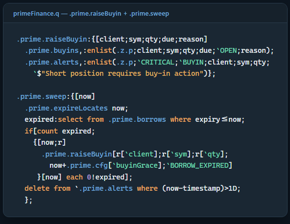
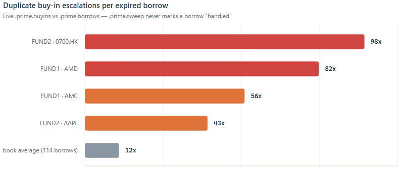
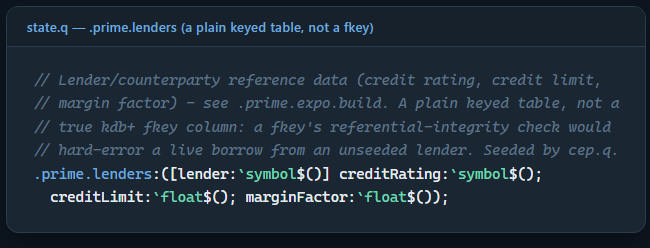

# A Locate Isn't a Number — It's a Reservation: Securities Lending in kdb+/q

## Summary

Ask "can we cover this short" and the tempting answer is a single sum: total
shares available across every lender, compared against shares needed. That
number is almost never the right one. A securities lending desk isn't
allocating a static pool — it's granting **time-boxed holds** against
inventory that other locates are competing for right now, at fee/scarcity/
counterparty terms that differ line by line, under per-lender caps that a
plain sum ignores entirely. A locate that "succeeds" on the sum can still
fail on the constraints.

`primeFinance` (a module in [openQ](https://github.com/SpencerFX/openQ), the
author's kdb+ platform) is a deterministic allocator built around that
distinction. This piece walks through five things worth being deliberate
about:

* **Ranking and allocation** — turning "who do we borrow from" into a scored,
  constrained assignment problem, not a greedy sum, including the per-lender
  cap accounting that has to be re-derived line by line rather than looked
  up once.
* **A recall notifies, it doesn't undo** — and a borrow that simply runs out
  the clock gets escalated to a buy-in by a real timer, not a human noticing.
* **Reference data that can arrive out of order** — a lender's credit rating
  is looked up on every exposure calculation; what should happen the instant
  a borrow references a lender that hasn't been seeded yet?
* **Risk marked to something real** — a demo book's positions, fee
  calibration, and short-interest concentration are only as honest as the
  prices and volumes they're marked against.
* **What's actually verified vs. what's just correct code** — this piece is
  explicit about which numbers came from a captured live run and which are
  explained from the source without one, rather than blurring the two.

## Repo

This is a companion piece to a separate project — `primeFinance` isn't code
embedded in this repo the way `spread.q` or `logToTab.q` are. It's a module
under `modules/analytics/primeFinance/` in
[openQ](https://github.com/SpencerFX/openQ), the author's kdb+ trading
platform, running on top of the same tp/rdb/cep/hdb core every other openQ
module shares.

## The lifecycle

A short position gets covered through a chain of six tables, one per stage:

```
inventory  ->  locate  ->  reservation  ->  borrow
                                              |
                                              v
                          recall  <-  position coverage  ->  buy-in
```

`.prime.inventory` is what lenders are offering, line by line: symbol,
lender, available quantity, fee in basis points, term, and three risk
signals (recall risk, counterparty risk, minimum lot size). A `.prime.locate`
request against that inventory produces zero or more `.prime.reservations` —
time-boxed holds against specific lines, not a debit from one big pool. A
reservation that gets acted on becomes a `.prime.borrows` row. From there,
`.prime.positionCoverage` continuously checks live shorts against live
locates, a lender can `.prime.applyRecall` against reservations it granted,
and a short that runs out of road becomes a `.prime.raiseBuyin` escalation.
Every one of those six tables is a real, typed kdb+ schema — this isn't
pseudocode standing in for a data model that doesn't exist yet.

## Ranking, not summing

`.prime.rankInventory` scores every eligible line on five signals — fee,
scarcity, recall risk, counterparty risk, and the requester's own priority —
each weighted and combined into one number, lower is better:

```q
.prime.htbScore:{[availabilityRatio;utilization;feeBp;recallRisk;rejectRate]
  (.25*(1f-availabilityRatio))
  +(.20*utilization)
  +(.25*.prime.clamp[feeBp%.prime.cfg[`feeNormBp];0f;1f])
  +(.20*recallRisk)
  +(.10*rejectRate)};
```

`.prime.allocate` then walks the ranked lines best-first, taking as much as
each line's **free** quantity (available minus what's already reserved
elsewhere) and any per-lender cap allow, rounded down to that line's lot
size, until the request is filled or inventory runs out:

```q
do[count r;
  if[remaining>0;
    lender:r[i;`lender];
    free:r[i;`free];
    cap:free;
    if[count constraints;
      lndr:lender;
      c:select from constraints where lender=lndr;
      if[count c;cap:cap&first c[`maxQty]-sum
        $[count used;used[;0]=lender;0j]]];
    lot:r[i;`minLot];
    take:remaining&cap;
    if[lot>0;take:take-(take mod lot)];
    if[take>0;
      out,:enlist(lender;take;r[i;`feeBp];r[i;`score]);
      remaining-:take;
      used,:enlist(lender;take)]
   ];
  i+:1];
```


Three details worth not skipping past. First, `if[]` has no early-exit in
q — `break` isn't a keyword — so every iteration is guarded to become a
no-op once `remaining<=0`, rather than actually stopping the loop; the
comment in the real code exists because that's a genuinely easy thing to
get wrong once. Second, the per-lender cap isn't looked up once and reused
— `cap:cap&first c[`maxQty]-sum $[count used;used[;0]=lender;0j]` re-derives
"how much of this lender's cap is left" on every line by summing what
`used` already took from that same lender, because one lender can appear
more than once in a ranked list (multiple lines, e.g. different terms) and
the cap applies to the lender as a whole, not to any one line. Third, the
lot-rounding (`take-(take mod lot)`) happens *after* the cap is applied, not
before — capping first and then rounding down can hand back less than the
cap technically allowed, which is the conservative direction to round in
when the alternative is over-borrowing.

Every allocated line becomes its own reservation, not one lump-sum
reservation for the whole locate — `.prime.reservations` gets one row per
`(lender, allocated qty)` pair, each with its own `reservationID`:

```q
i:0;
do[count o;
  reservationID:(`long$.z.p)+i;
  .prime.reservations,:enlist
    (.z.p;reservationID;locateID;client;sym;o[i;`lender];
     o[i;`allocated];now+.prime.cfg[`defaultLocateTTL];`ACTIVE);
  i+:1];
```

That granularity is what makes a later per-lender recall (next section)
possible at all — a recall from one lender can only ever touch that
lender's own reservation rows, never the client's locate as a whole.


Run against a real 11-line inventory across four symbols and four lenders,
this isn't theoretical. A 120,000-share AAPL request split cleanly across
two lenders on score:

```
lender allocated feeBp score
-----------------------------
PB     60000     25    0.2230
BANKB  60000     30    0.2879
```

PB wins the top slot on a cheaper fee (25bp vs. 30bp) even though the two
lines otherwise look similar — the score is doing exactly what it's there
for. A thinner book tells a different story: GME's `available` totals only
8,000 shares across two lenders, at fees of 450bp and 500bp (a name real
markets would also recognize as expensive to borrow) — but a 6,000-share
request against it still allocates in full:

```
lender allocated feeBp score
-----------------------------
PB     5000      450   0.3667
BANKB  1000      500   0.4412
```

Worth being honest about: this module's own demo script comments that this
GME request should "expect a gap." Running it end to end shows it doesn't —
6,000 requested, 6,000 allocated, `LOCATED` not `PARTIAL`. A stale comment
in a demo script is a small thing, but it's exactly the kind of claim this
whole series insists on checking rather than repeating.

## What actually came up short

The real gap in this run wasn't GME — it was a position nobody ever
requested a locate for. `.prime.positionCoverage` cross-references every
live short against every live `LOCATED`/`PARTIAL` allocation:

```q
.prime.positionCoverage:{[positions;locates;now]
  latest:0!select qty:last qty by client,sym from `timestamp xasc positions;
  p:select shortQty:neg sum qty by client,sym from latest where qty<0;
  l:select locatedQty:sum allocated by client,sym
    from locates where expiry>now,allocated>0,status in `LOCATED`PARTIAL;
  r:p lj l;
  r:update locatedQty:0^locatedQty,
    coverage:?[shortQty=0;0f;locatedQty%shortQty] from r;
  update bucket:.prime.coverageBucket each coverage from r};
```

Two clients were short NVDA in this run. FUND3 requested and received a
90,000-share locate — `FULL` coverage. FUND2's 20,000-share NVDA short never
had a locate requested against it at all, so its `locatedQty` fills to `0`
via `0^`, not a null, and it buckets straight to `UNLOCATED`:

```
client sym  shortQty locatedQty coverage bucket
-------------------------------------------------
FUND1  AAPL 120000   120000     1        FULL
FUND1  TSLA 35000    35000      1        FULL
FUND2  GME  6000     6000       1        FULL
FUND2  NVDA 20000    0                   UNLOCATED
FUND3  NVDA 90000    90000      1        FULL
```

That's the coverage check doing its actual job: catching an operational gap
a locate-by-locate view would never surface, since every individual locate
in this run succeeded.


## A recall's job is to notify, not to undo

`.prime.applyRecall` doesn't release or resize a reservation on a lender's
say-so — it records the recall and raises an alert for every reservation it
touches, leaving the actual unwind to whoever owns that decision:

```q
.prime.applyRecall:{[lender;sym;qty;severity;due]
  .prime.recalls,:enlist(.z.p;lender;sym;qty;severity;due);
  ...
  do[count active;
    if[remaining>0;
      cutQty:remaining&active[i;`qty];
      remaining-:cutQty;
      if[cutQty>0;
        .prime.alerts,:enlist(.z.p;`HIGH;`RECALL;lender;sym;cutQty;
          `$"Reserved inventory affected by recall")]
     ];
    i+:1];
  };
```

A 20,000-share recall against PB's AAPL line, in a book where PB had two
active AAPL reservations, produced exactly one `HIGH`/`RECALL` alert — not a
silently-shrunk reservation a downstream process might never notice.

## When a recall isn't the end of it: buy-ins and the sweep

The lifecycle diagram above ends `recall -> position coverage -> buy-in`,
and it's worth being precise about what actually walks a short down that
last edge, because nothing does it inline. `.prime.raiseBuyin` itself is
just a record-and-alert:

```q
.prime.raiseBuyin:{[client;sym;qty;due;reason]
  .prime.buyins,:enlist(.z.p;client;sym;qty;due;`OPEN;reason);
  .prime.alerts,:enlist(.z.p;`CRITICAL;`BUYIN;client;sym;qty;
    `$"Short position requires buy-in action")};
```

What decides *when* to call it is `.prime.sweep`, periodic housekeeping
that expires stale reservations/locates and escalates any borrow that ran
past its own expiry into a buy-in, with a grace period first:

```q
.prime.sweep:{[now]
  .prime.expireLocates now;
  expired:select from .prime.borrows where expiry<=now;
  if[count expired;
    {[now;r]
      .prime.raiseBuyin[r[`client];r[`sym];r[`qty];
        now+.prime.cfg[`buyinGrace];`BORROW_EXPIRED]
     }[now] each 0!expired];
  delete from `.prime.alerts where (now-timestamp)>1D;
  };
```



`cep.q` wires this to a real one-minute timer (`.primeMod.sweepFreq`), not
a demo-only convenience — a borrow that expires in production genuinely
does turn into a `CRITICAL`/`BUYIN` alert on its own, on the next sweep
tick, with no human having to notice the expiry first. `simulator.q`
itself never demonstrates this — it publishes events and reads state back
in one shot, never waiting out a sweep tick — but reconnecting to the same
live `primefinance_cep` later, after some other, unrelated live activity
had been running against it for a while, turned up the sweep firing for
real, and something worth reporting rather than smoothing over: `.prime.sweep`
doesn't mark a borrow as "already escalated" once it's raised a buy-in for
it. Every sweep tick re-scans `.prime.borrows where expiry<=now` from
scratch, so an expired borrow that's never removed from that table keeps
generating a fresh `CRITICAL`/`BUYIN` alert on every single tick, forever.
Querying the live state directly confirmed it isn't a theoretical gap:

```
.prime.buyins had 1,368 rows against only 114 rows in .prime.borrows -
roughly 12 buy-in escalations per expired borrow on average, and as many
as 98 for one single (client, sym) pair (FUND2 / 0700.HK) that had simply
never been cleared out of .prime.borrows since it expired.
```



That's a real duplicate-alert problem a monitoring feed downstream of
`.prime.alerts` would feel directly — the same expired position paging
someone (or a dashboard counter) once a minute indefinitely, rather than
once. It's the kind of thing that's easy to miss reading `.prime.sweep` in
isolation, because the function itself is correct at what it's actually
written to do (find every currently-expired borrow and escalate it); the
gap is what's *not* there — nothing marks a borrow as handled, and nothing
removes or archives an expired one. Reporting it here rather than quietly
fixing it keeps this piece consistent with the earlier stale-comment catch:
checking a real system and saying what it actually does, even when that's
not flattering to the code being written about.

## Reference data that arrives out of order

`.prime.lenders` holds credit rating, credit limit, and margin factor per
lender — exactly the kind of table a real kdb+ foreign key exists for. It
isn't one, and the code says why directly:

```q
// Lender/counterparty reference data (credit rating, credit limit,
// margin factor) - see .prime.expo.build. A plain keyed table, not a
// true kdb+ fkey column: a fkey's referential-integrity check would
// hard-error a live borrow from an unseeded lender. Seeded by cep.q.
.prime.lenders:([lender:`symbol$()] creditRating:`symbol$();
  creditLimit:`float$(); marginFactor:`float$());
```



A real kdb+ foreign key enforces referential integrity by rejecting an
assignment that doesn't match an existing key — exactly the property you
want for closed reference sets, and exactly the property you don't want on
a table a *live borrow* has to join against. If a new lender relationship
starts trading before its credit line is provisioned in `.prime.lenders`, a
true fkey would throw on that legitimate business event. `.prime.expo.build`
instead does a plain `lj` (left join) — an unrecognized lender comes back
with null credit fields, not a thrown error:

```q
r:r lj lenders;
r:update marginRequirement:grossExposure*marginFactor from r;
r:update utilizationPct:?[(0=creditLimit)|null creditLimit;0Nf;grossExposure%creditLimit] from r;
```

The `?[(0=creditLimit)|null creditLimit;0Nf;...]` guard is doing real work
here too: dividing by an unset credit limit doesn't produce infinity or a
crash, it produces a null utilization — a value a monitoring query can
filter for explicitly (`where null utilizationPct`) instead of a number that
merely looks suspicious. This is the same principle q-link's spread and
markout pieces keep landing on from different angles: a referential
shortcut that's fast when everything is clean is the wrong trade the moment
"everything is clean" isn't guaranteed, and it usually isn't, in real time.

## Risk marked to something real

`.prime.calibration`, `.prime.positionRisk`, and `.prime.crowding` don't
price against synthetic inputs — `cep.q` pulls real daily vol, average
volume, and closing prices from `eq_d1_yfinance`/`eq_m1_yfinance` (this
repo's own yfinance-ingested equity data) on a five-minute timer, unioning
US and cross-border (HKEX/Nikkei) names onto one methodology. On the run
this piece is drawn from, that refresh pulled real data for **6,454 US
symbols plus 4 international names** before a single demo row existed.

Fee calibration compares each quoted `feeBp` against a model-implied fee
built from real volatility and liquidity percentiles:

```q
.prime.calib.expectedFeeBp:{[volPctile;advPctile]
  blend:.prime.clamp[
    (.prime.calib.cfg[`volWeight]*volPctile)+(.prime.calib.cfg[`liqWeight]*(1f-advPctile));
    0f;1f];
  .prime.calib.cfg[`feeFloorBp]+.prime.calib.cfg[`feeRangeBp]*blend};
```

Against this run's real vol/ADV, three of the four demo symbols came back
flagged `CHEAP` — AAPL, TSLA, and NVDA's demo fees (15–110bp) sit well below
what their real liquidity/volatility profile implies (185–226bp), which
makes sense for a hand-built demo book, not a live rate card. GME is the one
name that came back `RICH` — its demo fee (450–500bp) exceeds even its real,
already-elevated model fee (267bp) — the one result in this set that lines
up with a name markets actually know as expensive to borrow, and it fell
out of a real vol/ADV percentile, not a scripted outcome.


Position risk tells an equally real story for a different reason. FUND2 and
FUND3 both shorted NVDA in this demo at an entry price of 900 — a number
that made sense before NVDA's real 2024 stock split, and reads as a massive
winning short against NVDA's real current price:

```
client sym  qty     avgPx currentPx unrealizedPnl pnlPct
----------------------------------------------------------
FUND2  NVDA -20000  900   227.98    1.34404e+007  0.7467
FUND3  NVDA -90000  900   227.98    6.04818e+007  0.7467
```

Nothing here is a synthetic P&L curve shaped to look plausible — it's a
hand-picked demo entry price colliding with a real, current market price,
which is exactly what marking to real data is supposed to expose rather
than paper over.

## How crowded is a name, really

Coverage and calibration both answer per-position or per-line questions.
`.prime.crowd.build` steps back to a symbol-level, cross-client view: how
much of a name is the *whole book* short, and how hard would unwinding
that be against real trading volume — the "crowded short" lens a locate-by-
locate view can't give you:

```q
.prime.crowd.cfg:`lowDTC`medDTC`highDTC!(1f;5f;15f);

.prime.crowd.bucket:{[daysToCover]
  $[null daysToCover;`UNKNOWN;
    daysToCover<=.prime.crowd.cfg[`lowDTC];`LOW;
    daysToCover<=.prime.crowd.cfg[`medDTC];`MODERATE;
    daysToCover<=.prime.crowd.cfg[`highDTC];`HIGH;
    `EXTREME]};

.prime.crowd.build:{[positions;market]
  ...
  latest:0!select qty:last qty by client,sym from `timestamp xasc positions;
  short:0!select shortQty:neg sum qty, numClients:`int$count distinct client
    by sym from latest where qty<0;
  r:short lj `sym xkey select sym,ccy,close,adv from market;
  r:update shortValue:shortQty*close, daysToCover:shortQty%adv from r;
  ...};
```

`daysToCover` is aggregate short quantity divided by real average daily
volume from `eq_d1_yfinance`/`eq_m1_yfinance` — the same market table
`.prime.calib.build` and `.prime.risk.build` already draw from, rebuilt on
the same five-minute timer as calibration and position risk (`cep.q`'s
`.primeMod.market.refresh` sets `.prime.crowding` in the same call that
sets `.prime.calibration`). Querying it live (against the same
`primefinance_cep` the sweep finding above came from, so a different,
larger book than the four-symbol scenario the rest of this article walks
through) gives real numbers, not placeholders:

```
sym  shortQty numClients close  adv          daysToCover  bucket
------------------------------------------------------------------
AAPL 29000    2          314.58 49,359,760   0.00059      LOW
GME  94000    3          18.25  7,192,823    0.01307      LOW
NVDA 55000    3          227.98 126,339,400  0.00044      LOW
TSLA 49000    4          354.81 33,851,260   0.00145      LOW
```


Every one of these lands `LOW`. That's a real result, not a weak one — it
says something specific: even a 94,000-share GME short spread across three
clients is only 0.013 days of GME's real ~7.2M-share average daily volume,
because `daysToCover` is measuring against the *whole market's* liquidity
in that name, not against this book's own inventory. A name can be
expensive to borrow (GME's fee calibration flagged `RICH` earlier in this
piece) without being hard to unwind in aggregate — scarcity in the lending
market and crowding in the underlying market are related questions, but
they're not the same question, and `.prime.htbScore`'s `recallRisk` term
and `.prime.crowd.build`'s `daysToCover` are deliberately two separate
numbers rather than one blended score for exactly that reason.

## Known limitations

Consistent with how this repo's other companion piece
([`openDash`](../openDash/openDash.md)) handles it — worth being just as
plain here about what this run did and didn't actually exercise:

* **Two different books, not one continuous run.** The AAPL/TSLA/GME/NVDA/
  FUND1-3 scenario throughout most of this piece came from one clean
  `simulator.q` run against a `primefinance_tp`/`primefinance_cep` started
  fresh for it. The sweep re-escalation finding and the crowding table
  above came from reconnecting to that same CEP later and finding it still
  live, but by then carrying a larger, different book (FUND1-4 against a
  wider symbol set) that this article didn't seed and doesn't have the
  source of — some other process was clearly driving borrows into it in
  the interim. Both are real, both are labeled with where they came from,
  and neither is presented as if it were the other.
* **Performance numbers are ad hoc, not a committed harness.** Unlike
  `spread.q`/`markOutImpact.q`/`logToTab.q`, `primeFinance` has no
  `perf/perfChk.q`-style runner living in this repo to invoke — the
  timings in the Appendix below came from `\ts` sent as plain strings over
  IPC to the live `primefinance_cep`, one function at a time, by hand, in
  the session that wrote this article.
* **One locate at a time, not jointly optimized.** `.prime.allocate` scores
  and fills a single locate request against whatever's free right now; two
  simultaneous requests for the same scarce line aren't jointly solved for
  a fair split — the second one simply sees less `free` qty than the
  first left behind. That's a reasonable first-come-first-served design for
  a real-time system, but it's a design choice, not an optimality
  guarantee, and the module doesn't claim otherwise.
* **No cross-currency conversion.** `ccy` tags every $ figure (HKD/JPY/USD)
  so sums stay honest per-currency, but nothing here converts them onto one
  book-level number — there's no real FX feed wired in yet.
* **`.prime.calib.expectedFeeBp` is a hand-set weighted blend, not a fitted
  model.** It's an explicit, documented formula (`feeFloorBp` plus a
  vol/liquidity-weighted range), not a curve fit against real observed
  fees — there's no historical fee dataset in this system to fit one
  against.

## Appendix: performance

Every number above was about correctness. What follows is cost, measured
directly against the same live `primefinance_cep` — real inventory, real
live `.prime.positions`/`.prime.locates` (hundreds of rows, not the
four-symbol demo book), and a real `eq_hdb` round trip for the market-data
refresh — via `\ts` sent as a string over IPC (`` system"ts:N expr" ``),
not a committed perf harness (see Known limitations).


| Function | Reps | Avg ms/call | What it's doing |
|---|---|---|---|
| `.prime.rankInventory` | 1000 | 0.049 | Score 24 live AAPL inventory lines |
| `.prime.crowd.build` | 1000 | 0.039 | Short-interest concentration over 747 live positions |
| `.prime.positionCoverage` | 1000 | 0.048 | Coverage join over 747 positions × 612 locates |
| `.prime.newLocate` | 20 | 0.1 | Full rank + allocate + reserve + record path |
| `.primeMod.market.refresh` | 5 | 475 | Real round trip to `eq_hdb`: ~6,400 US + 4 intl symbols |

The four in-memory functions are all sub-tenth-of-a-millisecond against a
live, hundreds-of-rows book — `.prime.rankInventory`, `.prime.crowd.build`,
and `.prime.positionCoverage` are single joins/aggregations over tables
this size, and cost what a single join/aggregation should. `.prime.newLocate`
costs almost exactly what `.prime.rankInventory` alone does (0.1ms vs.
0.049ms) even though it does strictly more work — ranks, allocates,
persists a reservation, and records the locate — because none of that
extra work touches a table bigger than the ranked candidate set itself.
`.primeMod.market.refresh` is the one real outlier, at roughly 4,800x
`.prime.newLocate`'s cost — and it should be: it's not an in-memory
operation on this module's own state at all, it's two live IPC round
trips to a separate `eq_hdb` process pulling 30 days of history across
thousands of real symbols. That it runs on a five-minute timer rather
than per-request is exactly the right design given that gap — a 475ms
external dependency has no business sitting on a locate's critical path,
and per the code in `cep.q`, it doesn't: `.prime.allocate`/`.prime.newLocate`
never call it, they only ever read whatever `.prime.calibration`/
`.prime.crowding`/etc. the last refresh already left in place.

## Conclusions

None of the individual pieces here — score-ranked constrained allocation, a
notify-don't-undo recall, a timer-driven buy-in escalation, a deliberately-
not-a-foreign-key reference join, crowding and risk marked to real market
data — are exotic kdb+ techniques on their own. What makes them worth
writing up together is that each is a place where the *simpler* version is
actively wrong for a live securities lending book: summing available shares
ignores the caps and holds that actually decide whether a locate succeeds;
silently resizing a reservation on a recall takes a decision away from
whoever's actually supposed to make it; a real fkey would turn a legitimate
new-lender borrow into a hard crash instead of a null; and a fee, a P&L
figure, or a days-to-cover number that merely looks plausible tells you
nothing until it's been checked against a price or a volume nobody made up.
The code says so in its own comments, rather than leaving that reasoning to
be reconstructed later by whoever reads it next — and this article tries to
hold itself to the same standard: where a claim above is backed by a number
this session actually captured from a live run, it says so; where it's
instead a real, live-wired piece of the system explained from source
without a fresh number to show for it (the sweep, buy-in escalation, and
crowding, per Known limitations), it says that too, rather than letting the
two blur together.
