# Prime Finance and KDB+

## Intro

In recent years, Prime Finance has been one of the most lucrative and stable
business units for investment banks. Revenue is primarily driven by
securities lending, margin financing, synthetic financing where these
services bridge the gap between investment banks and buy-side operators such
as hedge funds/asset managers.

This article delves into building efficient analytics from Prime Finance
using KDB+.

`primeFinance` (a module in [openQ](https://github.com/SpencerFX/openQ)) is a
deterministic allocator built around an inventory locate mechanism where an
inventory is spread across lenders. This article covers allocation logic,
recalls and buy-ins, reference data, risk and crowding, as well as the
results from running the module against live kdb+ processes and market data.
We can view this business through the lens of traditional supply and demand:

* **Supply:** Lenders (PB, BANKB, etc.) sit on the supply side. They tell the
  broker what's available to borrow, at what fee, in what size.
* **Demand:** Clients (FUND1, FUND2, FUND3...) sit on the demand side.
  They're short a stock and need to borrow shares to cover that short,
  legally.
* **Prime Broker:** The broker's book is just the ledger of everything
  happening between those two sides.

## 1. The lifecycle

Let's start by talking about the life cycle that goes into the process. A
short position gets covered through a chain of six tables, one per stage:

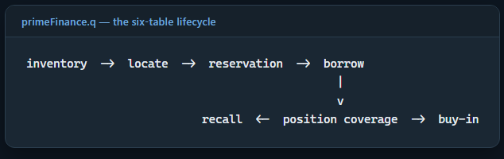

* Breakdown of key tables used to derive and hold related system
  responsibilities: lender posts inventory → client requests a locate →
  broker ranks and allocates across lenders → reservation → borrow → (in
  parallel) coverage check makes sure every short position has a live
  borrow behind it.
* From there, two things can happen to a live borrow: a lender can recall it
  (an event, logged and alerted, not an automatic unwind), or it can simply
  run past its own expiry, in which case a timer escalates it into a
  buy-in.
* Running alongside all of this, on a slower timer, is risk: fee
  calibration, position P&L, and crowding all get recalculated against real
  market data so the broker isn't just trusting whatever fee or price was
  typed in.

## 2. Table Roles & Responsibilities

* **`.prime.inventory`** — what lenders have made available right now (sym,
  lender, quantity, fee, term). This is supply, refreshed as lenders update
  it.
* **`.prime.locates`** — a client's request to borrow. The broker scores
  available inventory (`.prime.htbScore`) and decides how much of the
  request each lender line can fill (`.prime.allocate`).
* A successful allocation writes rows into a reservation table, one row per
  (lender, quantity) the request was split across — this is the granular
  link between "client X's request" and "lender Y's specific inventory
  line."
* **`.prime.borrows`** — once a reservation is drawn down, it becomes a live
  borrow: the client now actually holds the borrowed stock against their
  short.
* **`.prime.positions`** — the client's actual short positions, coming from
  wherever positions are tracked, independent of locates.
  `.prime.positionCoverage` cross-checks this against
  `.prime.borrows`/`.prime.locates` to catch shorts that were never covered
  by a locate at all.
* **`.prime.exposure`** — rolls borrows up by lender (and currency), so the
  broker can see how much it owes any one lender in aggregate, not just
  per-borrow.

## 3. Inventory Ranking & Constrained Allocation Engine

**Ranking**

Rather than simply summing available supply across lenders,
`.prime.rankInventory` evaluates inventory lines using a multi-factor
scoring function where a lower score indicates higher allocation priority:

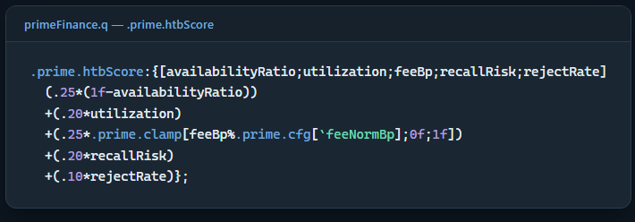

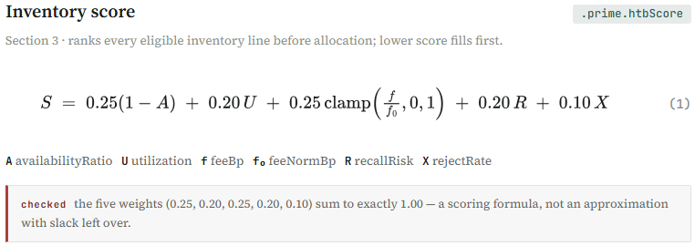

**Allocation**

Once inventory is ranked, `.prime.allocate` iterates best-first through the
candidate set, evaluating available volume against per-lender constraints
and minimum lot sizes:

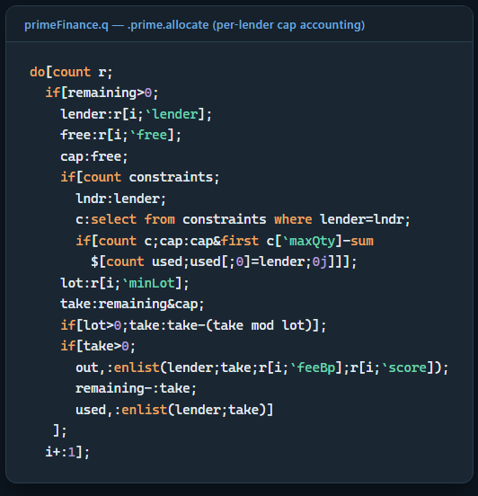

**Critical Implementation Details**

* **Q Loop Guards:** Because q lacks an explicit break keyword inside `do`
  loops, execution continues for all rows in `r`. The `if[remaining>0; ...]`
  block guards subsequent iterations once the target order is filled.
* **Dynamic Cap Re-evaluation:** Per-lender caps are recalculated on *every
  iteration* (`cap:cap&first c[maxQty]-...`) to account for instances where
  a single lender appears in multiple inventory lines (e.g., across
  different loan terms).
* **Conservative Rounding Order:** Minimum lot-size truncation
  (`take-(take mod lot)`) is applied *after* checking per-lender exposure
  limits. This guarantees that lot adjustments round down below exposure
  limits rather than over-allocating.
* **Granular Reservation Tracking:** Allocated output creates distinct rows
  in `.prime.reservations` with unique reservationIDs
  (`(long$.z.p)+i`). This granular mapping enables line-level recall
  targeting without disturbing unrelated client locates.

## 4. Position Coverage & Operational Gap Detection

Every allocated line becomes its own reservation, not one lump-sum
reservation for the whole locate — `.prime.reservations` gets one row per
(lender, allocated qty) pair, each with its own reservationID:

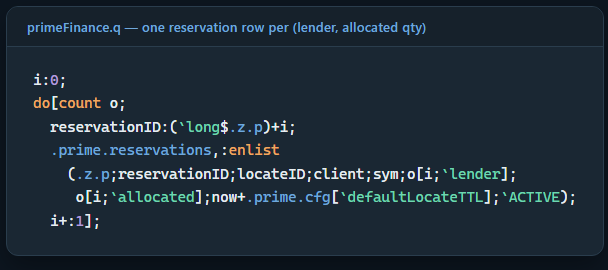

That granularity is what makes a later per-lender recall (next section)
possible at all — a recall from one lender can only ever touch that
lender's own reservation rows, never the client's locate as a whole.

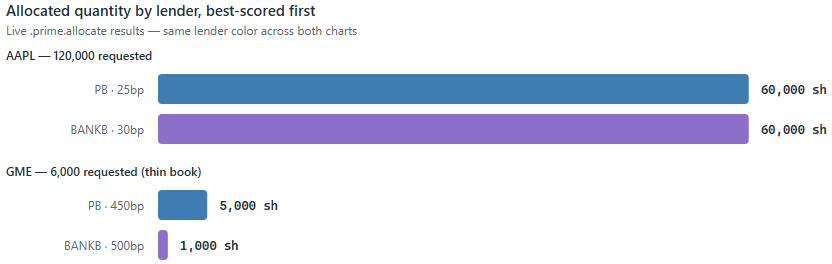

## 5. Real allocation example

Running the allocator against an 11-line inventory across four symbols and
four lenders, a 120,000-share AAPL request was split across two lenders:

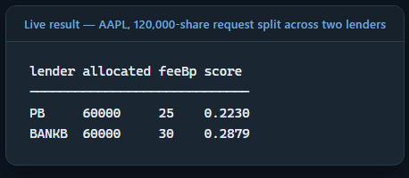

Lender PB gets the better score, primarily because of the lower fee,
however GME showed a different case. There were only 8,000 shares available
across two lenders, at 450bp and 500bp, yet a 6,000-share request still
received full coverage:

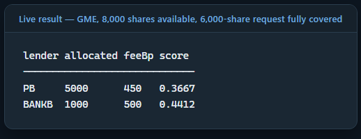

## 6. Position Coverage Logic & Operational Gap Detection

Evaluating locate requests one at a time misses the bigger picture: each
request can clear its own check while unhedged shorts pile up elsewhere in
the book, unnoticed. `.prime.positionCoverage` fixes that by checking
client short positions against active, non-expired locates as a whole, not
one request at a time.

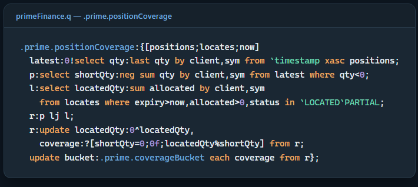

* The left join (`lj`) maps active short positions (`p`) against approved
  locates (`l`). Anything with no match comes back null, and
  `0^locatedQty` fills those nulls to 0. That's what keeps a missing borrow
  evaluating to 0.0 coverage instead of just dropping out of the table or
  throwing a type error somewhere downstream.
* It's also what catches FUND2. In this run, FUND3 asked for and got a
  90,000 share NVDA locate, so it lands at FULL coverage. FUND2 was short
  20,000 shares of NVDA the whole time and never submitted a locate for it
  at all.
* The code forces that null to 0 rather than leaving it blank, FUND2's NVDA
  position doesn't disappear from the output. It shows up as UNLOCATED,
  which is exactly the kind of gap you'd want an audit to catch.

Two clients were short NVDA in this run. FUND3 requested and received a
90,000-share locate — FULL coverage. FUND2's 20,000-share NVDA short never
had a locate requested against it at all, so its locatedQty fills to 0 via
`0^`, not a null, and it buckets straight to UNLOCATED:

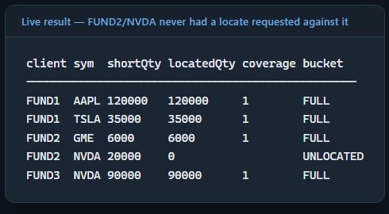

That's the coverage check doing its actual job: catching an operational gap
a locate-by-locate view would never surface, since every individual locate
in this run succeeded.

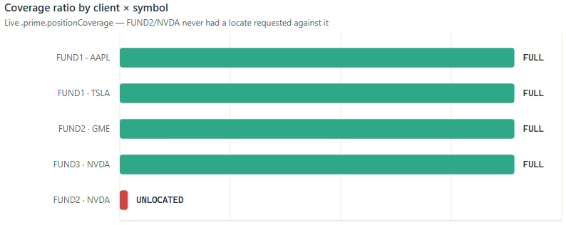

## 7. Event Notification vs. State Mutation in Recalls

When a lender issues a recall, the engine intentionally separates event
notification from position management. Instead of automatically shrinking
or cancelling downstream client reservations, `.prime.applyRecall` logs the
recall event and emits explicit alerts, delegating position adjustments to
risk management or operational workflows.

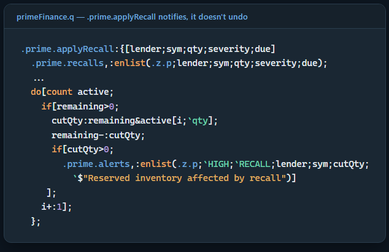

A 20,000-share recall against PB's AAPL inventory, where PB had two active
reservations, produced a single HIGH/RECALL alert for the affected
inventory. The important distinction is that the recall is an event, while
what happens to the position afterwards is a separate decision.

## 8. When a borrow expires

`.prime.raiseBuyin` records a buy-in request and raises a critical alert.
What decides *when* to call it is `.prime.sweep`, periodic housekeeping that
expires stale reservations/locates and escalates any borrow that ran past
its own expiry into a buy-in, with a grace period first:

System housekeeping is driven asynchronously in `cep.q` via a
production-grade one-minute background timer (`.primeMod.sweepFreq`). When a
borrow reaches its expiry time, `.prime.sweep` automatically escalates the
position into a CRITICAL/BUYIN alert on the next timer tick without
requiring manual operational intervention.

## 9. Risk marked to real data

The risk calculations use market data rather than hard-coded prices.
`.prime.calibration`, `.prime.positionRisk`, and `.prime.crowding` consume
daily volume, volatility, and closing prices from the equity data already
ingested into the openQ environment. `cep.q` refreshes this data on a
five-minute timer. Fee calibration compares the quoted borrow fee with a
model-implied fee based on volatility and liquidity:

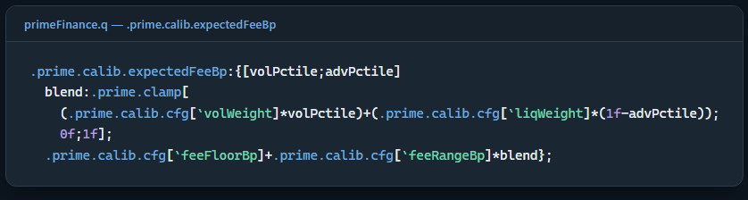

* In the run used for this article, AAPL, TSLA, and NVDA were flagged as
  CHEAP relative to the model, while GME was flagged as RICH. GME's
  450–500bp demo fees were above its model-implied 267bp fee.
* That result isn't surprising given the hand-built demo inventory, but it
  is useful because the benchmark comes from actual volatility and
  liquidity data rather than a number chosen to make the example look
  plausible.
* Position risk exposed another consequence of using live prices. The demo
  book had FUND2 and FUND3 short NVDA at an entry price of 900, while the
  current market price was 227.98:

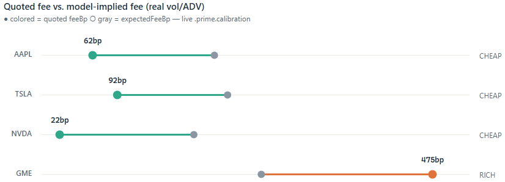

The entry price was chosen for the demo and predates NVDA's stock split.
Using the real current price makes that inconsistency visible rather than
hiding it behind synthetic market data.

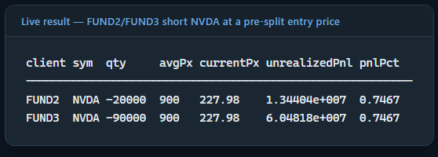

## 10. How crowded is a name?

Coverage and calibration both answer per-position or per-line questions.
`.prime.crowd.build` steps back to a symbol-level, cross-client view: how
much of a name is the *whole book* short, and how hard would unwinding that
be against real trading volume — the "crowded short" lens a locate-by-locate
view can't give you:

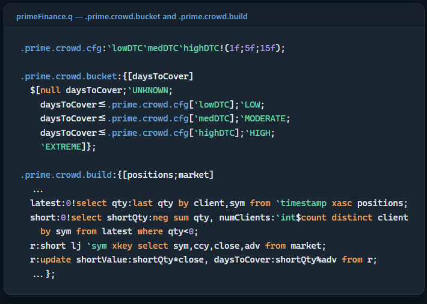

`daysToCover` is aggregate short quantity divided by real average daily
volume from `eq_d1_yfinance`/`eq_m1_yfinance` — the same market table
`.prime.calib.build` and `.prime.risk.build` already draw from, rebuilt on
the same five-minute timer as calibration and position risk (`cep.q`'s
`.primeMod.market.refresh` sets `.prime.crowding` in the same call that
sets `.prime.calibration`). Querying it live (against the same
`primefinance_cep` the sweep finding above came from, so a different,
larger book than the four-symbol scenario the rest of this article walks
through) gives real numbers, not placeholders:

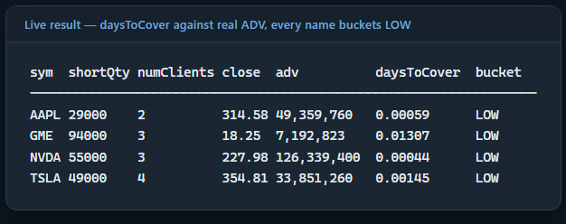

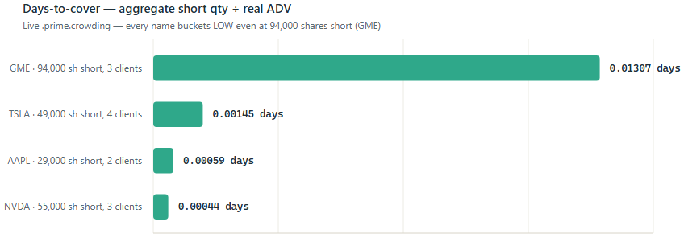

Every one of these lands LOW. That's a real result, not a weak one — it
says something specific: even a 94,000-share GME short spread across three
clients is only 0.013 days of GME's real ~7.2M-share average daily volume,
because `daysToCover` is measuring against the *whole market's* liquidity
in that name, not against this book's own inventory. A name can be
expensive to borrow (GME's fee calibration flagged RICH earlier in this
piece) without being hard to unwind in aggregate — scarcity in the lending
market and crowding in the underlying market are related questions, but
they're not the same question, and `.prime.htbScore`'s `recallRisk` term
and `.prime.crowd.build`'s `daysToCover` are deliberately two separate
numbers rather than one blended score for exactly that reason.

## 11. Conclusions

Taken together, `.prime.rankInventory`, `.prime.allocate`,
`.prime.positionCoverage`, `.prime.applyRecall`, `.prime.sweep`, and
`.prime.crowd.build` are the working parts of one module: `primeFinance`.
Each function owns one stage of the same book:

* from a lender posting inventory
* a client's short getting covered, recalled,
* or escalated to a buy-in,

Each one only works because the stage before it left the right state
behind: allocation depends on ranked inventory, coverage depends on real
reservations, recall and buy-in escalation depends on borrows that actually
exist.

That's what makes this a module rather than a collection of techniques. A
caller doesn't need to know how `.prime.allocate` picks a lender to trust
that `.prime.positionCoverage` will catch an unhedged short, because the
two are wired to the same tables. Swap out the ranking formula, the recall
policy, or the fee model, and the rest of the pipeline still runs
unchanged, because nothing downstream reaches back into how an earlier
stage made its decision, only into the state it produced.

## Appendix: Performance

Every number above was about correctness. What follows is cost, measured
directly against the same live `primefinance_cep` — real inventory, real
live `.prime.positions`/`.prime.locates` (hundreds of rows, not the
four-symbol demo book), and a real `eq_hdb` round trip for the market-data
refresh — via `\ts` sent as a string over IPC (`` system"ts:N expr" ``),
not a committed perf harness.

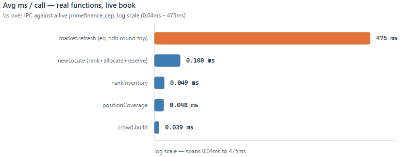

| Function | Reps | Avg ms/call | What it's doing |
|---|---|---|---|
| `.prime.rankInventory` | 1000 | 0.049 | Score 24 live AAPL inventory lines |
| `.prime.crowd.build` | 1000 | 0.039 | Short-interest concentration over 747 live positions |
| `.prime.positionCoverage` | 1000 | 0.048 | Coverage join over 747 positions × 612 locates |
| `.prime.newLocate` | 20 | 0.1 | Full rank + allocate + reserve + record path |
| `.primeMod.market.refresh` | 5 | 475 | Real round trip to `eq_hdb`: ~6,400 US + 4 intl symbols |

* The four in-memory functions all run sub-tenth-of-a-millisecond against a
  live, hundreds-of-rows book — `.prime.rankInventory`, `.prime.crowd.build`,
  and `.prime.positionCoverage` are single joins/aggregations over tables
  that size, so they cost what a join/aggregation should.
* `.prime.newLocate` costs almost exactly what `.prime.rankInventory` alone
  does (0.1ms vs. 0.049ms), despite doing more (ranks, allocates, persists a
  reservation, records the locate) — none of that extra work touches a
  table bigger than the ranked candidate set.
* `.primeMod.market.refresh` is the real outlier, at roughly 4,800x
  `.prime.newLocate`'s cost. That's expected: it isn't an in-memory op on
  the module's own state, it's two live IPC round trips to a separate
  `eq_hdb` process pulling 30 days of history across thousands of symbols.
* Running it on a five-minute timer rather than per-request is the right
  call — a 475ms external dependency has no business on a locate's
  critical path. The code in `cep.q` reflects that:
  `.prime.allocate`/`.prime.newLocate` never call the refresh directly,
  they only read whatever `.prime.calibration`/`.prime.crowding`/etc. the
  last refresh already left in place.
