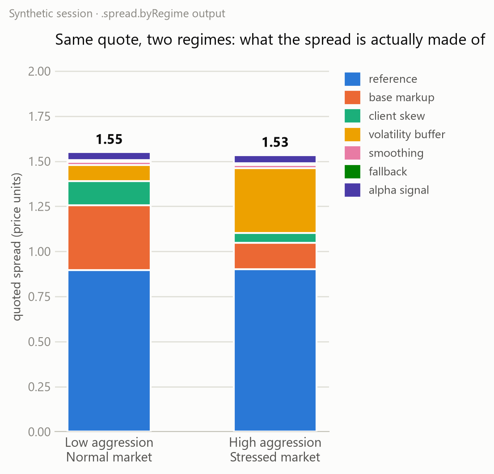
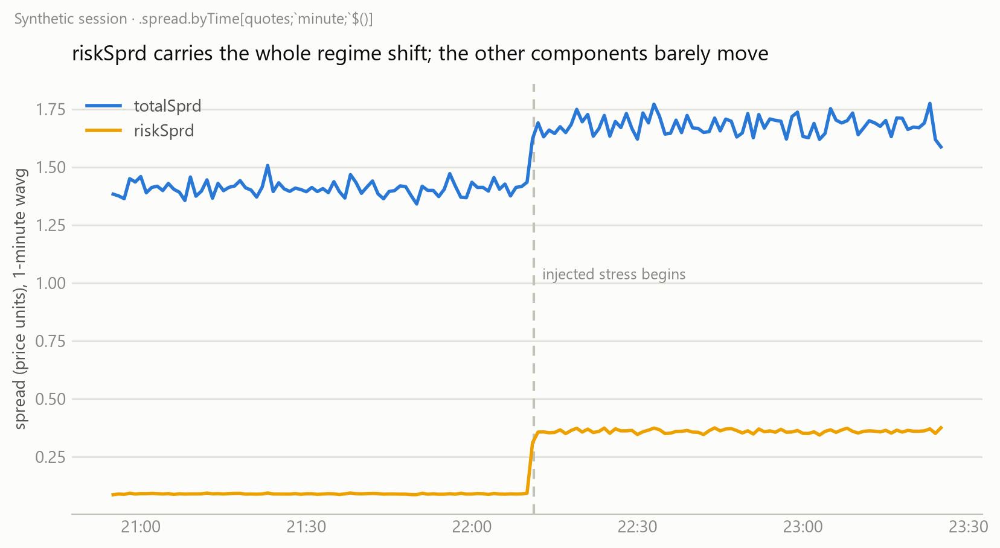
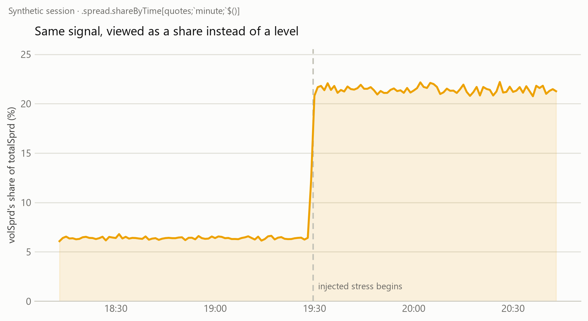
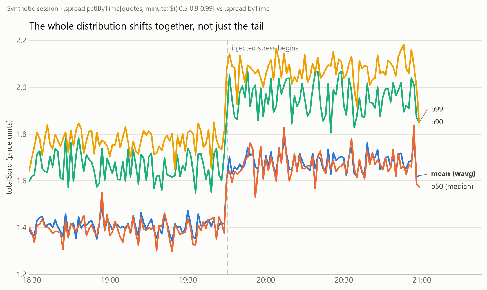
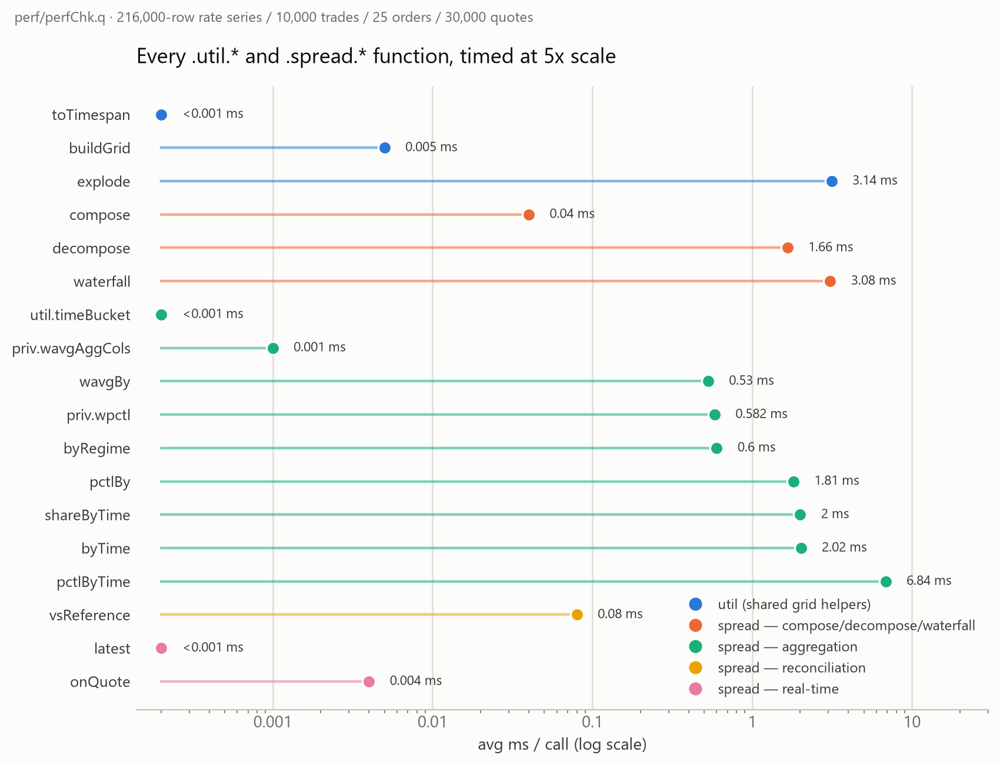

# Explaining the Spread: Decomposing an FX Quote in kdb+/q

## Summary

A pricing engine's quoted spread is never just one number — it's the sum of several
named adjustments stacked on top of a reference level: a base markup, a client-tier
skew, a volatility buffer, quote-stability smoothing, a fallback component, and a
directional-signal adjustment. In the context of this article and the code:

* **Composition** asks the simple direction: given the named components, what's the
  total quoted spread? A one-line row-wise sum.
* **Decomposition and aggregation** ask the harder question: once you have thousands
  of quotes a day across symbols, aggression levels, and market regimes, how much of
  the spread is coming from *which* component, on average, and does that hold up when
  you slice by time instead of by tag? Get the weighting wrong and every rollup lies.
* **Reconciliation** asks a third question: is what the model quoted actually
  consistent with an independent reference — richer, cheaper, in line?

This is a different shape of problem to [markout / market impact](../markout/markOutImpact.pdf).
There, the components are hidden — you observe a single noisy price curve after a
trade and have to *infer* a temporary/permanent split from it. Here, the components
are already columns in the row the moment the quote is generated; nothing needs to be
estimated. The engineering problem is entirely downstream: aggregating an additive
decomposition without breaking the weighting, and checking the result against
something outside the model.

## Repo

* The code discussed in this article is at: **https://github.com/SpencerFX/q-link**
* To load the functions, synthetic data, and explore interactively:
  ```
  q ./scripts/initSpread.q
  ```
* To run the test suite (hard assertions, ground-truth checks included):
  ```
  q ./test/testSpread.q
  ```

## The component model

A quote is modelled as seven named components summing to a total:

```q
.spread.componentCols:`refSprd`baseSprd`clientSprd`volSprd`smoothSprd`fallbackSprd`alphaSprd;

.spread.compose:{[tab]
  update totalSprd:sum value flip .spread.componentCols#tab from tab
 };
```

| Component | What it represents |
|---|---|
| `refSprd` | reference/baseline spread before any adjustment |
| `baseSprd` | core pricing-engine markup |
| `clientSprd` | client-tier/relationship skew |
| `volSprd` | volatility risk buffer — widens under elevated vol |
| `smoothSprd` | quote-stability smoothing — dampens jumps between quotes |
| `fallbackSprd` | supplemental buffer, used when other inputs are thin |
| `alphaSprd` | directional-signal adjustment |

```
q)meta scenario`quotes
c           | t f a
------------| -----
time        | p   s
sym         | s
aggression  | s
marketStatus| s
weight      | f
refSprd     | f
baseSprd    | f
clientSprd  | f
volSprd     | f
smoothSprd  | f
fallbackSprd| f
alphaSprd   | f
totalSprd   | f
```

`.spread.decompose` melts that into one row per (quote, component) — the shape a
stacked-bar or attribution view wants — and `.spread.waterfall` appends a running
cumulative column per component, so `cum_alphaSprd == totalSprd` on every row by
construction. Both are exact, not fitted: no residual, no goodness-of-fit statistic,
because there's nothing being estimated.

## One weighting rule, three entry points

The part worth being careful about is aggregation. A single quote's spread means
nothing on its own — the number that matters is the size-weighted average across many
quotes, and that weighting has to be applied *consistently* whether you're rolling up
by regime, by time, or by nothing at all. Rather than writing that three times, one
private helper builds the aggregate-column spec and every public rollup threads
through it:

```q
.spread.priv.wavgAggCols:{[wCols]
  (`weight,wCols)!enlist[(sum;`weight)],{(wavg;`weight;x)} each wCols
 };

.spread.wavgBy:{[tab;keyCols]
  t:$[`totalSprd in cols tab;tab;.spread.compose tab];
  wCols:.spread.componentCols,`totalSprd;
  ?[t;();keyCols!keyCols;.spread.priv.wavgAggCols wCols]
 };
```

`wavgAggCols` builds the spec as one direct key-vector/value-vector zip — `` `weight,wCols `` for keys, `(sum;`weight)` followed by one `(wavg;`weight;col)` tuple per column for values — rather than building a one-item dict per column and unioning them. Same result, one dict allocation instead of `count[wCols]+1`.

`.spread.byTime` and `.spread.byRegime` are both a handful of lines on top of the same
helper — `byTime` swaps in a time-bucket parse-tree as the group-by key, `byRegime`
just calls `wavgBy` with whatever regime columns the caller passes it (e.g.
`` `aggression`marketStatus ``) prepended to any extra keys. One weighting
convention, three ways to slice it.

## On data

To check the aggregation and reconciliation logic against a known answer rather than
plausible-looking output, `data/spreadGenerator.q` builds a synthetic session with
three effects injected in advance:

* **A market-status regime shift.** The first half of the session is tagged `normal`,
  the second half `stressed`, and `volSprd` is multiplied by a known factor
  (**4.0x**) for every stressed quote. Nothing else is touched.
* **An aggression tightening.** `baseSprd` and `clientSprd` scale by a known
  per-aggression-level multiplier (`low`=1.0, `medium`=0.7, `high`=0.4) — more
  aggressive pricing quotes tighter.
* **An independent benchmark series** built from the model's own `totalSprd` minus a
  known constant offset (**0.05** price units, i.e. 500 on the `1e4*` bps convention
  `.spread.vsReference` uses) plus noise — standing in for a rate the model didn't
  produce itself, for testing reconciliation.

```q
stressFactor:?[marketStatus=`stressed;.spreadSynth.config.stressVolMult;1f];
volSprd:0.1*baseLevel*stressFactor*noise[n];
...
benchmark:update benchmarkSprd:totalSprd-richness+0.01*.spreadSynth.priv.randNorm[n]
  from select time,sym,totalSprd from quotes;
```

Note: this generator isn't a model of how a real pricing engine actually sets a
spread — it's a controlled way to know the right answer in advance, the same role
GBM plays in the markout/impact piece's synthetic rate series.

## Interpreting the results

`scripts/initSpread.q` builds a 6,000-quote synthetic session (3 symbols, 3 aggression
levels, two regimes), runs it through `.spread.wavgBy` and `.spread.vsReference`, and
leaves `recovery` in the workspace — the same check `test/testSpread.q` asserts on
non-interactively:

```
q)recovery
check         expected recovered relErrPct  pass
------------------------------------------------
stressVolMult 4        4.004076  0.101891   1
richnessBps   500      500.2515  0.05029823 1
```

* **stressVolMult** — grouping all 6,000 quotes by `marketStatus` alone and taking
  the ratio of average `volSprd` (stressed ÷ normal) recovers the injected 4.0x
  multiplier to within ~0.1%.
* **richnessBps** — joining the model's composed `totalSprd` against the independent
  benchmark series on `` `time`sym `` via `.spread.vsReference` and averaging the
  recovered `richnessBps` recovers the injected 500-unit richness to within ~0.05%.

The aggression effect isn't in the automated check above, but it's directly visible
in `.spread.byRegime`'s output — comparing `low` against `high` aggression *within
the same* `normal` market status:

```
aggression marketStatus  baseSprd   clientSprd
low        normal        0.3585052  0.1343631
high       normal        0.1438458  0.05404622
```

`0.1438458 / 0.3585052 ≈ 0.401` and `0.05404622 / 0.1343631 ≈ 0.402` — both land on
the injected `` aggressionMult[`high] `` of 0.4, recovered independently for two
different components.



That chart picks two realistic composite scenarios rather than isolating one
variable — a calm, low-aggression quote versus an aggressive quote issued into a
stressed market — and it's worth noticing what the totals do: **1.55 vs. 1.53,
almost unchanged.** The tighter base markup and client skew from aggressive pricing
very nearly cancel the wider volatility buffer from the stress regime. A dashboard
that only shows `totalSprd` would report these two quotes as practically identical;
the decomposition shows they got there by two completely different routes. That gap
— same total, different composition — is the entire reason to keep the components
around instead of collapsing to one number at write time.



The second chart rolls the same session up by `` .spread.byTime[quotes;`minute;`$()] ``
instead of by regime tag — a completely independent aggregation path — and recovers
the same step: `volSprd` jumps at the injected transition, `totalSprd` follows it,
and every other component stays flat. Two unrelated rollups agreeing on the same
signal is itself a form of validation.

## One more composition: share, not just level

`byTime` answers "what's the average level of `volSprd`". A related but different
question is "what *fraction* of the spread is `volSprd` responsible for, and does
that change over the session" — level and share tell different stories whenever the
other components are moving too. That question turns out to need no new machinery:
`.spread.decompose` already melts a wide row into one row per component with a
`pctOfTotal`, and `.spread.byTime`'s output is exactly quote-shaped (every component
column plus `totalSprd`) — so decomposing a `byTime` result, rather than raw quotes,
gives share-over-time for free:

```q
.spread.shareByTime:{[tab;bucket;extraKeyCols] .spread.decompose .spread.byTime[tab;bucket;extraKeyCols]};
```

The order matters. `byTime` has to run *first*: a component's share in a bucket must
be the ratio of its own weighted average to the bucket's weighted total, not an
average of each quote's individual `pctOfTotal` — averaging ratios directly gives the
wrong answer the moment weight varies within the bucket. Doing it in this order,
`pctOfTotal` sums to exactly 100 within every bucket by construction, the same
invariant `.spread.waterfall`'s `cum_alphaSprd == totalSprd` gives for a single row.



Same session, same transition, same component — but the y-axis is now "% of
`totalSprd`" instead of price units. `volSprd` goes from ~6% of the quoted spread to
~21% at the stress transition. That framing matters for a different audience than the
level chart does: a pricing manager asking "is the vol buffer blowing out my margins
today" cares about the share, not the raw number, and the two aren't always telling
the same story — a component can hold a *constant* share while the total (and
therefore its absolute level) moves, or vice versa.

Building `.spread.decompose` to unkey its input defensively (`0!` before the column
select) is what makes this composition possible at all: `byTime`'s output is a keyed
table (every `?[]` group-by result is), and naively feeding a keyed table into code
written against a plain one is exactly the kind of thing that looks fine until you
actually chain two functions together.

## The mean can hide the tail

Every rollup so far — `wavgBy`, `byTime`, `byRegime`, `shareByTime` — answers with a
single weighted average. An average can look perfectly calm while a chunk of the
distribution behind it is not: three quotes at 1.30 and one at 4.00 average out to
1.68, a number that undersells what actually happened on that fourth quote. A pricing
desk asking "how bad does this ever get" needs the tail, not the center.

`wavg` is a q built-in; there's no equivalent built-in for a *weighted* percentile, so
`.spread.priv.wpctl` implements the standard nearest-rank method — sort by value, walk
cumulative weight in that order, and return the value at the point the cumulative
weight fraction first reaches `p`:

```q
.spread.priv.wpctl:{[p;w;x]
  ord:iasc x;
  cw:(sums w ord)%sum w;
  (x ord) first where cw>=p
 };
```

Nearest-rank rather than interpolated is a deliberate choice: the value returned was
always an actual observed quote, matching how a "worst 1% of the time" read is
usually meant in a risk context, rather than a smoothed statistical estimate. Because
`wpctl` takes the same `(weight, value) -> number` shape `wavg` does, it drops
straight into the same aggregate-spec pattern `.spread.priv.wavgAggCols` already
established — `.spread.priv.pctlAggCols` is that function's percentile counterpart,
and `.spread.pctlBy`/`.spread.pctlByTime` are `wavgBy`/`byTime` with it swapped in:

```q
.spread.pctlByTime:{[tab;bucket;extraKeyCols;percentiles]
  t:$[`totalSprd in cols tab;tab;.spread.compose tab];
  aggC:(extraKeyCols!extraKeyCols),enlist[`time]!enlist .spread.util.timeBucket[bucket;`time];
  ?[t;();aggC;.spread.priv.pctlAggCols[percentiles;`totalSprd]]
 };
```



Run against the same synthetic session as every other chart here, `p50`/`p90`/`p99`
all jump at the stress transition together with the mean — the gap between them
doesn't widen the way it would if the stress were a tail-specific event (an occasional
very-wide quote pulling `p99` up while `p50` stayed put). That's not a null result: it
*confirms* the injected stress here is a uniform level-shift affecting every quote by
the same factor, exactly matching how `data/spreadGenerator.q` built it — `volSprd`'s
multiplier applies to every stressed quote equally, not to a random few. Percentile
analysis earns its place precisely by being able to tell these two situations apart;
this session happens to land on the "uniform shift" side of that distinction, and
knowing that for certain is worth more than assuming it.

Sorting isn't free: `perf/perfSpread.q` shows `pctlByTime` at roughly 3.4x `byTime`'s
cost (a full sort per bucket vs. one weighted sum), the one rollup in this library
where reaching for the distribution instead of the mean has a real, measurable price.

## Reconciliation vs. an outside reference

`.spread.vsReference` joins the model's composed total against any independently
sourced spread series and reports richness in both bps and pct:

```q
.spread.vsReference:{[modelTab;refTab;keyCols;refCol]
  m:$[`totalSprd in cols modelTab;modelTab;.spread.compose modelTab];
  mSel:keyCols xkey ?[m;();0b;(keyCols!keyCols),enlist[`modelSprd]!enlist`totalSprd];
  rSel:keyCols xkey ?[refTab;();0b;(keyCols!keyCols),enlist[`refSprd]!enlist refCol];
  res:0!mSel,'rSel;
  update richnessBps:1e4*modelSprd-refSprd, richnessPct:100*(modelSprd-refSprd)%refSprd from res
 };
```

The obvious use is a pricing-desk sanity check — is what we're quoting consistent
with a competitor feed, a prior model version, or an internal benchmark rate — but
it's the same shape regardless of what `refTab` actually is: any two independently
produced spread series, reconciled on shared keys.

## Conclusions

Spread decomposition and market impact both live under the same broad heading —
pricing/post-trade analytics — and they're close to opposite problems. Market impact
starts with one noisy number (price after the fact) and has to recover a hidden
temporary/permanent structure from it, which is why that piece needed a parametric
fit and a goodness-of-fit statistic to know if the recovery was any good. Spread
decomposition starts with the structure already given — every component is a column
the pricing engine already computed — so there's nothing to estimate. The entire job
is downstream: aggregate an additive decomposition without breaking the weighting no
matter which dimension you slice by, and check the result against something the model
didn't produce itself.

Both pieces lean on the same discipline to know the code is actually right rather
than just plausible: build a synthetic scenario with a known answer baked in, and
require the functions to reproduce that number, not merely something in the right
ballpark.

## Appendix: performance

Correctness aside, it's worth knowing what these functions actually cost. `perf/perfChk.q`
is a shared timing harness (functions only); two per-article runners load it and time
every public function in their own analytics file against realistic-sized synthetic
data, via kdb+'s built-in `\ts` time+space profiler (called programmatically,
`` system"ts do[n;expr]" ``, so the (ms;bytes) pair can be captured and averaged over
`n` reps rather than only printed). Below is the `.util.*` and `.spread.*` subset —
the shared offset-grid helpers plus every function discussed in this article — run at
5x the session size used above: a 216,000-row rate series, 10,000 trades, 25 orders,
and 30,000 quotes.

```
q perf/perfMarkOut.q   # .util.* (this table's util rows)
q perf/perfSpread.q    # .spread.* (this table's spread rows)
```



| Function | Reps | Avg ms/call |
|---|---|---|
| `.util.buildGrid` | 2000 | 0.005 |
| `.util.toTimespan` | 2000 | <0.001 |
| `.util.explode` | 50 | 3.14 |
| `.spread.compose` | 100 | 0.05 |
| `.spread.decompose` | 50 | 1.52 |
| `.spread.waterfall` | 50 | 4.04 |
| `.spread.priv.wavgAggCols` | 2000 | 0.001 |
| `.spread.util.timeBucket` | 2000 | <0.001 |
| `.spread.wavgBy` | 100 | 0.47 |
| `.spread.byRegime` | 100 | 0.59 |
| `.spread.byTime` | 50 | 1.98 |
| `.spread.shareByTime` | 50 | 1.9 |
| `.spread.priv.wpctl` | 2000 | 0.582 |
| `.spread.pctlBy` | 100 | 1.81 |
| `.spread.pctlByTime` | 50 | 6.84 |
| `.spread.vsReference` | 50 | 0.08 |
| `.spread.onQuote` | 1000 | 0.004 |
| `.spread.latest` | 1000 | <0.001 |

A few things stand out. The pure grid/dict helpers (`buildGrid`, `toTimespan`,
`priv.wavgAggCols`, `util.timeBucket`) are all sub-microsecond to low-microsecond —
they're building small fixed-size structures, not touching the quote table at all.
`.spread.compose` is essentially free (0.05ms for 30,000 rows) since it's one row-wise
sum; `decompose` and `waterfall` cost more (1.5–4ms) because they each build several
full-sized intermediate tables (one per component, or one cumulative column per
component) rather than a single pass. The aggregations (`wavgBy`, `byRegime`, `byTime`)
land under 2ms even grouping and weight-averaging all 30,000 rows — `byTime` is the
most expensive of the three because its time-bucket key produces more distinct groups
than a coarse regime tag does. `shareByTime` costs almost exactly what `byTime` alone
does (1.9ms vs. 1.98ms) — `decompose` only runs against the small, already-aggregated
bucket table it produces, not the original 30,000 rows, so melting it into shares is
nearly free on top. The percentile rollups are the clear outliers: `pctlBy` costs
roughly 3.8x `wavgBy`'s (1.81ms vs. 0.53ms), and `pctlByTime` costs roughly 3.4x
`byTime`'s (6.84ms vs. 2.02ms) — the one place in this library where a full sort per
group, rather than a running sum, actually shows up in the numbers.
`.spread.onQuote` (the real-time path) is flat at
0.004ms regardless of session size, as it should be — it upserts one row into a table
keyed by a small, bounded (sym, aggression, marketStatus) key space, never touching
the historical quote volume at all.

The two `<0.001` rows (`toTimespan`, `latest`) reported exactly `0` from the profiler —
below `\ts`'s millisecond resolution at this call cost, not literally free.